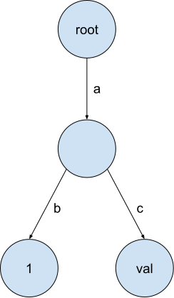

# PROJECT #0 - C++ PRIMER

## Project Specification

In this project, you will implement **a key-value store backed by a copy-on-write trie**.

The key-value store you will implement can store **string keys mapped to values of any type**. The value of a key is stored in the node representing the last character of that key (aka terminal node).


<figure markdown>
{width="200"}
</figure>

## Task #1 - Copy-On-Write Trie

!!! note "Copy-On-Write Trie"
    Modify `trie.h` and `trie.cpp` to implement a copy-on-write trie. Your trie must support three operations:

    * `Get(key)`: Get the value corresponding to the key.
    * `Put(key, value)`: Set the corresponding value to the key. Overwrite existing value if the key already exists. Note that the type of the value might be non-copyable (i.e., `std::unique_ptr<int>`). This method returns a new trie.
    * `Delete(key)`: Delete the value for the key. This method returns a new trie.

对于三个操作来说，整体思路都是根据`key`一步步往下走，进行相应的操作。`Get`最简单，搜不到某个字符的话返回`nullptr`就行了，`Put`搜不到字符时应该新建一个节点。`Delete`需要递归，从Trie的底部一直往上删。

Copy-On-Write最重要的一点是**不能修改原来的Trie**，如果要做修改，就要复制一份新的Trie，然后修改新的Trie。

## Task #2 - Concurrent Key-Value Store

!!! note "Concurrent Key-Value Store"
    * Modify `trie_store.h` and `trie_store.cpp` to implement a concurrent key-value store for a multithreaded environment.
    * Also, if we get a reference to a value from the trie, we should be able to access it no matter how we modify the trie.

本来我以为要重新实现`Get`, `Put`, `Delete`，但是我发现调用Task #1中已经实现的就好了。
`Trie_Store`这个class似乎只是给之前的`Trie`加了一些`mutex`来保证线程安全。

## Task #3 - Debugging

关于Trie的小问题，很简单。

## Task #4 - SQL String Functions

!!! note "SQL String Functions"
    Implement upper and lower SQL functions. This can be done in 2 steps:
    
    1. implement the function logic in `string_expression.h`.
    2. register the function in BusTub, so that the SQL framework can call your function when the user executes a SQL, in `plan_func_call.cpp`.

Well，还是很简单。问题是，现在做的是局部的更改，而我不知道`plan_func_call.cpp`是怎么被调用的，为什么用它来注册函数。。。。。算了先继续往下学吧。

运行Autograder :)
```
Autograder Score
100.0 / 100.0
Passed Tests
Build.Prepare (0/0)
Build.Configure (0/0)
Build.ClangFormat (0/0)
Build.ClangTidy (0/0)
Build (0/0)
Build.TSAN (0/0)
Build.Release (0/0)
TrieTest.ConstructorTest (1/1)
TrieTest.BasicPutTest (2/2)
TrieTest.BasicPutGetTest (2/2)
TrieTest.PutGetOnePath (2/2)
TrieTest.BasicRemoveTest1 (2/2)
TrieTest.BasicRemoveTest2 (2/2)
TrieTest.MismatchTypeTest (2/2)
TrieTest.CopyOnWriteTest1 (3/3)
TrieTest.CopyOnWriteTest2 (3/3)
TrieTest.CopyOnWriteTest3 (3/3)
TrieTest.PointerStability (3/3)
TrieDebugger.TestCase (5/5)
TrieTest.NonCopyableTest (3/3)
TrieTest.TrieStructureCheck (2/2)
TrieTest.RemoveFreeTest (3/3)
TrieTest.MixedTest (8/8)
TrieStoreTest.BasicTest (3/3)
TrieStoreTest.GuardTest (3/3)
TrieStoreTest.ReadWriteTest (8/8)
TrieStoreTest.NonCopyableTest (8/8)
TrieStoreTest.MixedTest (7/7)
TrieStoreTest.MixedConcurrentTest (5/5)
TrieTest.MixedTest.Rel (3/3)
TrieStoreTest.MixedConcurrentTest.Rel (3/3)
SQLLogicTest.p0.01-lower-upper (3/3)
SQLLogicTest.p0.02-function-error (3/3)
SQLLogicTest.p0.03-string-scan (5/5)
TrieStoreTest.MixedConcurrentTest.TSAN (3/3)
```