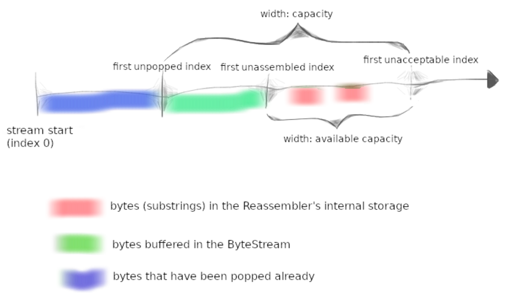

# Lab 1: stitching substrings into a byte stream

Over the coming weeks, you’ll implement TCP yourself, to provide the byte-stream abstraction between a pair of computers separated by an unreliable datagram network.

* **TCP receiver**: receives datagrams and turns them into a reliable byte stream to be read from the socket by the application.
* **TCP sender**: divides its byte stream into short *segments* so that each segment fits into a single datagram, and sends the segments to the receiver.

The network might reorder these datagrams, or drop them, or deliver them more than once. **The receiver must reassemble the segments into the contiguous stream of bytes that they started out as.**

In this lab you’ll write the data structure that will be responsible for this reassembly: a *Reassembler*.

!!! question "Why am I doing this?"
    Providing a service or an abstraction on top of a different less-reliable service accounts for many of the interesting problems in networking.

## Putting substrings in sequence

### Interface

```cpp
// Insert a new substring to be reassembled into a ByteStream.
void insert( uint64_t first_index, std::string data, bool is_last_substring );

// How many bytes are stored in the Reassembler itself?
uint64_t bytes_pending() const;

// Access output stream reader
Reader& reader() { return output_.reader(); }
```

!!! question "Why am I doing this?"
    TCP robustness against reordering and duplication comes from its ability to stitch arbitrary excerpts of the byte stream back into the original stream. Implementing this in a discrete testable module will make handling incoming segments easier.

### What should the Reassembler store internally?

In principle, the `Reassembler` will have to handle three categories of knowledge:

1. Bytes that are the **next bytes** in the stream. The `Reassembler` should push these to the stream (`output_.writer()`) as soon as they are known.
2. Bytes that fit within the stream's available capacity but can't yet be written, because earlier bytes remain unknown. These should be stored internally in the `Reassembler`.
3. Bytes that lie beyond the stream's available capacity. These should be discarded. The `Reassembler`'s will not store any bytes that can't be pushed to the ByteStream either immediately, or as soon as earlier bytes become known.

The goal of this behavior is to **limit the amount of memory** used by the `Reassembler` and 
the `ByteStream`, no matter how the incoming substrings arrive.



### Implementation

#### Data structure

```cpp
class Reassembler
{
// ...

private:
  ByteStream output_; // the Reassembler writes to this ByteStream
  uint64_t next_index_; // next byte index to write
  uint64_t unassembled_bytes_; // total number of unassembled bytes
  uint64_t eof_index_; // index that represents the end of the stream
  std::map<uint64_t, std::string> substrings_; // store substrings
};
```

可以结合上面的示意图理解代码。

我用`std::map<uint64_t, std::string> substrings_`来存储那些还不能写入`ByteStream output_`
的、处于pending状态的substring，其中`uint64_t`是substring的起始index，`std::string`是substring的内容。
`unassembled_bytes_`就是这些pending substring的总字节数。`substrings_`就是示意图中
红色的部分：“bytes(substrings) that in the `Reassembler`'s internal storage”。

`next_index_`是下一个可以写入`ByteStream output_`的index，也就是示意图中的绿色部分(bytes buffered in the `ByteStream`)的末尾index。

以上就是本次实现的data structure.

#### `insert` 

输入：substring以及一些metadata。思路如下：

1. 这个substring有没有超过capacity（超过的话装不下）这个substring的信息是不是之前已经写入了（重复的substring没用）
2. **IMPORTANT**：检查这个substring是否与之前的存在`substrings_`中的substring有overlap，如果有overlap，就要进行相应的处理。
       1. 非常重要！必须保证`substrings_`中的substring是互不overlap的，否则会导致`unassembled_bytes_`等数据计算错误！
3. 更新`substrings_`，`unassembled_bytes_`
4. 遍历`substrings_`，看看新加入的substring是否能够将之前分散的substring连接起来，并能够写入`ByteStream`.
   
还有一些细节，比如index的更新、EOF的判定等等，不再赘述。

```sh
❯ cmake --build build --target check1
Test project /home/ubuntu/CS144-minnow/build
      Start  1: compile with bug-checkers
 1/17 Test  #1: compile with bug-checkers ........   Passed    0.29 sec
      Start  3: byte_stream_basics
 2/17 Test  #3: byte_stream_basics ...............   Passed    0.01 sec
      Start  4: byte_stream_capacity
 3/17 Test  #4: byte_stream_capacity .............   Passed    0.01 sec
      Start  5: byte_stream_one_write
 4/17 Test  #5: byte_stream_one_write ............   Passed    0.01 sec
      Start  6: byte_stream_two_writes
 5/17 Test  #6: byte_stream_two_writes ...........   Passed    0.01 sec
      Start  7: byte_stream_many_writes
 6/17 Test  #7: byte_stream_many_writes ..........   Passed    0.06 sec
      Start  8: byte_stream_stress_test
 7/17 Test  #8: byte_stream_stress_test ..........   Passed    0.03 sec
      Start  9: reassembler_single
 8/17 Test  #9: reassembler_single ...............   Passed    0.01 sec
      Start 10: reassembler_cap
 9/17 Test #10: reassembler_cap ..................   Passed    0.01 sec
      Start 11: reassembler_seq
10/17 Test #11: reassembler_seq ..................   Passed    0.02 sec
      Start 12: reassembler_dup
11/17 Test #12: reassembler_dup ..................   Passed    0.04 sec
      Start 13: reassembler_holes
12/17 Test #13: reassembler_holes ................   Passed    0.01 sec
      Start 14: reassembler_overlapping
13/17 Test #14: reassembler_overlapping ..........   Passed    0.02 sec
      Start 15: reassembler_win
14/17 Test #15: reassembler_win ..................   Passed    0.32 sec
      Start 37: compile with optimization
15/17 Test #37: compile with optimization ........   Passed    0.07 sec
      Start 38: byte_stream_speed_test
             ByteStream throughput: 3.08 Gbit/s
16/17 Test #38: byte_stream_speed_test ...........   Passed    0.25 sec
      Start 39: reassembler_speed_test
             Reassembler throughput: 6.91 Gbit/s
17/17 Test #39: reassembler_speed_test ...........   Passed    0.40 sec

100% tests passed, 0 tests failed out of 17

Total Test time (real) =   1.59 sec
Built target check1
```