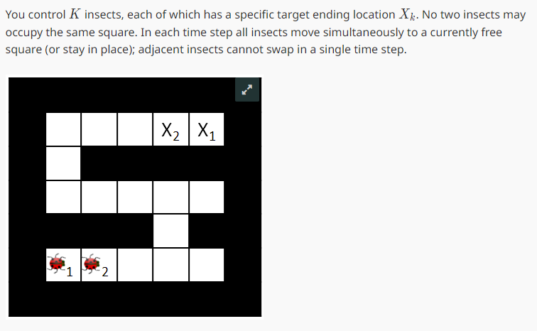
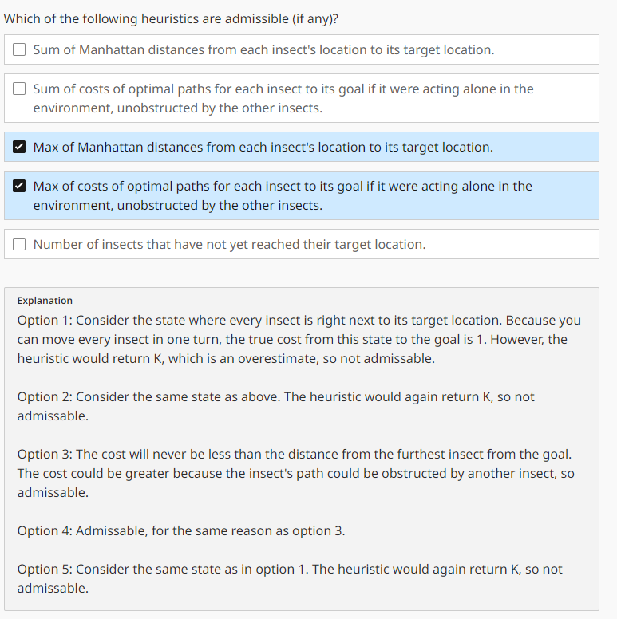
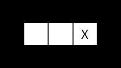
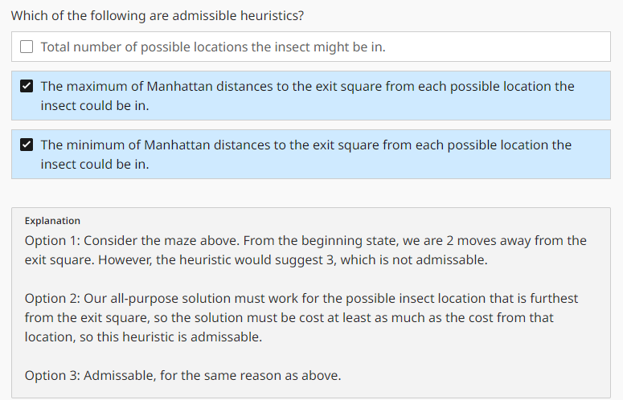

# HW1

## Q7 Hive Minds: Swarm Movement

{width=100%}

{width=100%}

先回顾一下admissibility:

Defining $h^*(n)$ as the true optimal
forward cost to reach a goal state a given node $n$, 
we can formulate the adimissibility constraint as:

$$
\forall n, \quad 0 \leq h(n) \leq h^*(n)
$$

以选项4为例，$h(n)$是*Max of costs of optimal paths for each insect to its goal if it were acting alone in the environment, unobstructed by the other insects.* 真实的cost $h^*(n)$肯定会大于等于$h(n)$，因为insect之间会互相干扰，所以$h(n)$是admissible的。

## Q10 Hive Minds: Lost at Night

It is night and you control a single insect. You know the maze, but you do not know what square the insect will start in. You must **pose a search problem whose solution is an all-purpose sequence of actions such that, after executing those actions, the insect is guaranteed to be on the exit square, regardless of initial position**. The insect executes the actions mindlessly and does not know whether its moves succeed: if it uses an action which would move it in a blocked direction, it will stay where it is. For example, in the maze below, moving right twice guarantees that the insect will be at the exit regardless of its starting position.

{width=30%}

### Q10.1

Which of the following state representations could be used to solve this problem?

**Answer**: A list of boolean variables, one for each position in the maze, indicating whether the insect could be in that position.

我去。。。第一次碰到这种问题，想了半天才搞懂。state是一个boolean list，表示insect可能在哪个位置。我们并不知道insect的初始位置，所以一开始所有位置都是可能的，这个list里面全是True。然后我们开始搜索，每次搜索都会根据insect的移动方向更新这个list。

Goal test: $list[x_{goal}][y_{goal}] = True$, 其他位置都是$False$。

Successor: Actions available to us are {NORTH,SOUTH,EAST,WEST}。以WEST为例：

```
for x in range(width):

    for y in range(height):

        bool_next[x][y] = bool[x+1][y] or (bool[x][y] and is_wall((x-1,y)))
```

### Q10.3

{width=100%}

只要满足$\forall n, \quad 0 \leq h(n) \leq h^*(n)$，都能算admissible.

## Summary

HW1题量大，并且需要一定的思考，给我的周末上了很大的强度(我感觉在这样997下去我就要累死了)。

HW1大概包括了以下内容：A\* Search、DFS、BFS、UCS的理解以及细节深挖；state space的构建、admissible heuristic和consistent heuristic的理解。

