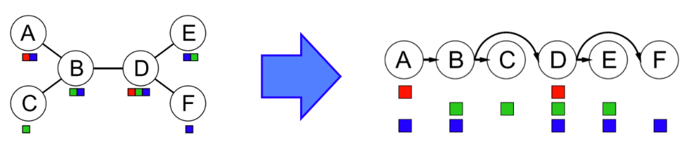
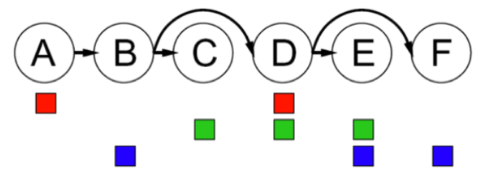
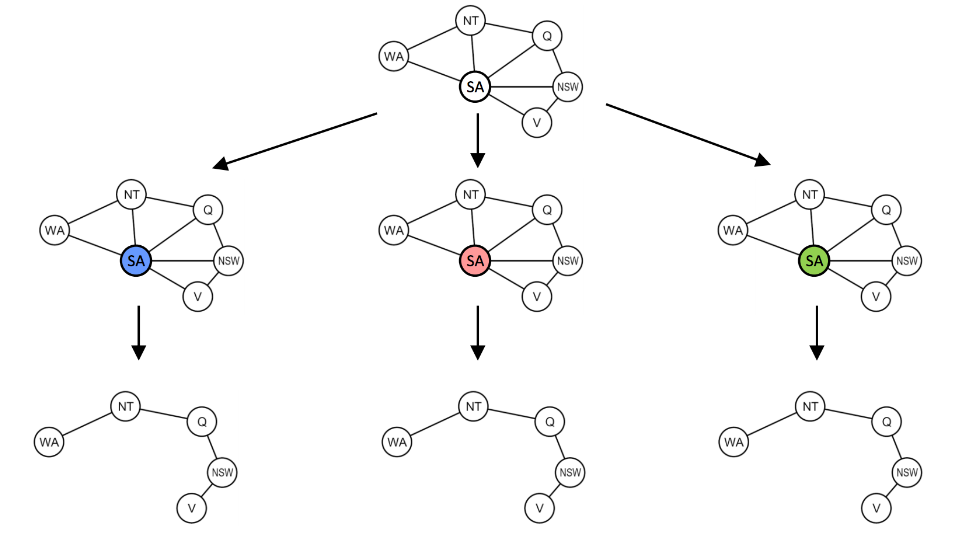
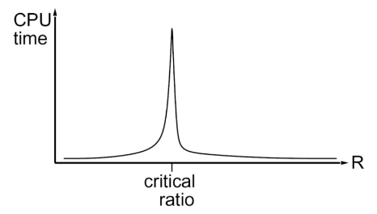
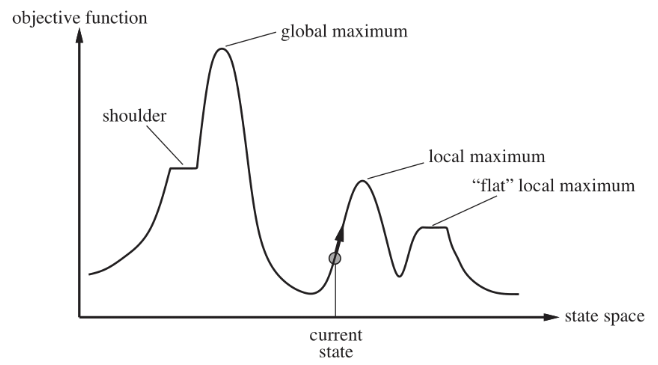

# Constraint Satisfaction Problems

CSPs are a type of **identification problem**, problems in which
we must simply identify whether a state is a goal state or not,
with no regard to how we arrive at that goal.

CSPs are defined by three factors:

1. **Variables**: $X_1, X_2, \ldots, X_n$ 
2. **Domains**: A set of $\{x_1, x_2, \ldots, x_d\}$ representing all possible values 
    that a CSP variable can take on.
3. **Constraints**: Defines restrictions on the values of variables.

> Constraints satisfaction problems are NP-Hard.

We can often get around this by formulating CSPs as search problems,
defining states as **partial assignments**.

### Constraint Graphs

> Another CSP example: map coloring.
>
> Color a map such that no two adjacent regions have the same color.

{width="400"}

Constraint satisfaction problems are often represented as **constraint graphs**,
where nodes represent variables and edges represent constraints between them.

* *Unary constraints*: involve a single variable in the CSP.
* *Binary constraints*: involve two variables in the CSP.
* *Higher-order constraints*: involve more than two variables.

The value of constraint graphs is that we can use them to extract valuable
information about the structure of the CSPs we are solving.

## Solving Constraint Satisfaction Problems

**Backtracking search**, an optimization on depth-first search, is used
specifically for the problem of constraint satisfaction, with
improvements coming from two main principles:

1. Fix an ordering for variables, and select values for variables in this order.
2. When selecting values for a variable, only select values that
    don't conflict with any previously assigned variables.

{width="700"}

Though backtracking search is a vast improvement over the brute-forcing of depth first search, we can get more gains in speed still with further improvements through filtering, variable/value ordering, and structural explotation.

## Filtering

!!! tip ""
    Checks if we can **prune the domains of unassigned variables ahead of time** by removing
    values we know will result in backtracking.

### Naive approach: Forward Checking

Whenever a value is assigned to a variable $X_i$, prunes the domains of
unassigned variables that share a constraint with $X_i$ that would
violate the constraint if assigned.

The idea of forward checking can be generalized to **arc consistency**.

### Arc Consistency

!!! info
    For arc consistency, we interpret each undirected edge of the constraint graph
    for a CSP as two directed edges pointing to opposite directions.
    Each of these directed edges is called an **arc**.

Arc consistency关注的是二元约束，也就是涉及两个变量的约束。对于一个arc，
在tail的domain中任意一个值都能找到一个head的值，使得这两个值满足约束，那么这个arc就是consistent的。
对于一个CSP，如果所有的arc都是consistent的，那么这个CSP就是arc consistent的。

!!! tip "Takeaway"

    * If X loses a value, neighbors of X need to be rechecked.
    * Arc consistency detects failure earlier than forward checking.
    * Can be run as a preprocessor or after each assignment.
    * Remember: delete from the tail!

The arc consistency algorithm is as follows:

* Begin by storing all arcs in the constraint graph for the CSP in a queue $Q$.
* Iteratively remove arcs from $Q$ and enforce the condition that in each removed arc
    $X_{i} \longrightarrow X_{j}$, for every remaining value $v$ for the tail variable
    $X_i$, there is at least one remaining value $w$ for the head variable $X_j$ such that
    the assignment $X_i = v$ and $X_j = w$ does not violate any constrains.
    If some value $v$ for $X_i$ would not work with any of the remaining values for $X_j$,
    we remove $v$ from the set of possible values for $X_i$.
* If at least one value is removed for $X_i$ when enforcing arc consistency for an arc
    $X_i \longrightarrow X_j$, add arcs of the form $X_k \longrightarrow X_i$ to $Q$,
    for all unassigned variables $X_k$.
* Continue until $Q$ is empty, or the domain of some variables is empty and 
    triggers a backtrack.

Arc consistency is typically implemented with the AC-3 algorithm:

!!! quote ""
    

## Ordering

!!! note ""
    It’s often much more effective to compute the next variable and corresponding value "on the fly" with two broad principles, **minimum remaining values** and **least constraining value**.

* *Minimum Remaining Values (MRV)* - When selecting which variable to assign next, using an MRV policy chooses whichever unassigned variable has the fewest valid remaining values (the *most constrained variable*).
    * Fail-fast ordering: 你总要赋值给所有的变量，那么现在有一些变量有很多remaining values(易处理)，有一些变量只有很少的remaining values(难处理)，那么你就应该先处理那些难搞的变量，这样如果有问题，你就能早点发现，早点backtrack，而不是浪费时间在搞easy stuff，最后才发现有问题。     
* *Least Constraining Value (LCV)* - Similarly, when selecting which value to assign next, a good policy to implement is to select the value that prunes the fewest values from the domains of the remaining unassigned values.
    * 跟选择variable的时候不同，你并不需要把所有的value都试一遍，所以你可以先尝试那些prune最少的value，这样你给其他variable留下的domain就会更大，更有可能找到一个solution。

## Structure

A final class of improvements to solving constraint satisfaction problems are those that exploit their structure.

### Tree-Structured CSPs

We can solve **tree-structured CSPs** (one that has no loops in its constraint graph) in $O(n \cdot d^2)$ time, using the tree-structured CSP algorithm:

* Pick an arbitrary node in the constraint graph for the CSP to serve as the root of the tree.
* Convert all undirected edges in the tree to directed edges that point away from the root. Then **linearize** (or **topologically sort**) the resulting directed acyclic graph.
      * 简单来说就是把tree转化成一个有向图，然后把node排序，让每一条edge都是从左往右指的。

{width="800"}

* Perform a **backwards pass** of arc consistency.
      * 从右往左遍历，enforce arc consistency for all arcs $Parent(X_i) \longrightarrow X_i$.
      * 这可能会prune掉一些value。

{width="400"}

* Finally, perform a **forwards assignment**.
    * Starting from $X_1$ and going to $X_n$ (从左往右), assign each $X_i$ a value consistent with that of its parents.
    * Because we’ve enforced arc consistency on all of these arcs, this iterative assignment guarantees a correct solution.

#### Cutset Conditioning

有些CSP的constraint graph不是tree-structured的，但是我们可以通过cutset conditioning来把它变成tree-structured的，然后再用tree-structured CSP algorithm来解决。

{width="800"}

* First finding the smallest subset of variables in a constraint graph such that their removal results in a tree (such a subset is known as a **cutset** for the graph).
* Once the smallest cutset is found, we assign all variables in it and prune the domains of all neighboring nodes.
* What’s left is a tree-structured CSP, upon which we can solve with the tree-structured CSP algorithm.

## Local Search

Backtracking search isn't the only algorithm for solving constraint satisfaction problems. Another widely used algorithm is **local search**.

!!! tip "Idea"
    **Iterative improvement** - start with some random assignment to values then iteratively select a random conflicted variable and reassign its value to the one that violates the fewest constraints until no more constraint violations exist (a policy known as the *min-conflicts heuristic*).

Local search is both incomplete and suboptimal, there is a critical ratio around which using local search becomes extremely expensive:

$$
R = \frac{number \ \ of \ \ constraints}{number \ \ of \ \ variables}
$$

{width="400"}

We wish to find the state that corresponds to the highest objective value.

{width="700"}

The basic idea of local search algorithms is that from each state they locally move towards states that have a higher objective value until a maximum (hopefully the global) is reached.

### Hill-Climbing Search

* Moves to better states but can get trapped at local maxima or plateaus.
* Variants like stochastic hill-climbing improve results at the cost of more iterations.

### Simulated Annealing Search

* Aims to combine random walk (randomly moves to nearby states) and hill-climbing to obtain a complete and efficient search algorithm.

### Genetic Algorithms

## Summary

Constraint satisfaction problems in general don't have an efficient algorithm which solves them in polynomial time.

However, we can often find solutions in an acceptable amount of time:

* *Filtering* - Filtering handles **pruning the domains of unassigned variables ahead of time to prevent unnecessary backtracking**. The two important filtering techniques we’ve covered are *forward checking* and *arc consistency*.
* *Ordering* - Ordering handles **selection of which variable or value to assign next to make backtracking as unlikely as possible**. For variable selection, we learned about a *MRV policy* and for value selection we learned about a *LCV policy*.
* *Structure* - If a CSP is tree-structured or close to tree-structured, we can **run the tree-structured CSP algorithm on it to derive a solution in linear time**. Similarly, if a CSP is close to tree structured, we can use *cutset conditioning* to transform the CSP into one or more independent tree-structured CSPs and solve each of these separately.