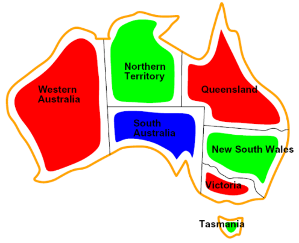
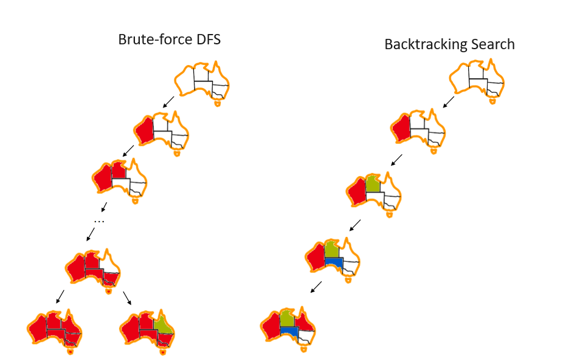
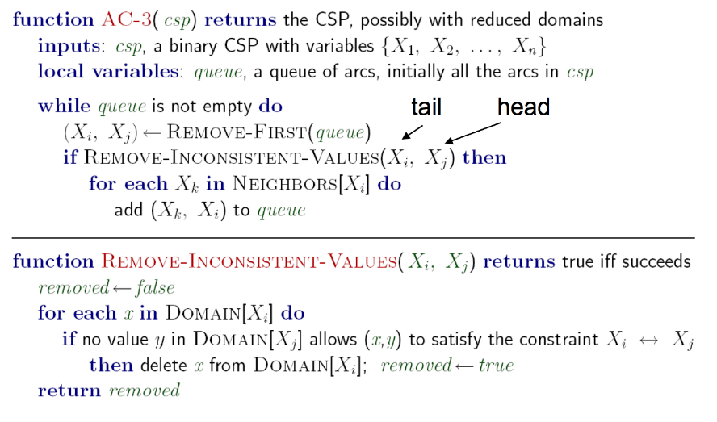

# Constraint Satisfaction Problems

CSPs are a type of **identification problem**, problems in which
we must simply identify whether a state is a goal state or not,
with no regard to how we arrive at that goal.

CSPs are defined by three factors:

1. **Variables**: $X_1, X_2, \ldots, X_n$ 
2. **Domains**: A set of $\{x_1, x_2, \ldots, x_d\}$ representing all possible values 
    that a CSP variable can take on.
3. **Constraints**: Defines restrictions on the values of variables.

> Constraints satisfaction problems are NP-Hard.

We can often get around this by formulating CSPs as search problems,
defining states as **partial assignments**.

### Constraint Graphs

> Another CSP example: map coloring.
>
> Color a map such that no two adjacent regions have the same color.

{width="400"}

Constraint satisfaction problems are often represented as **constraint graphs**,
where nodes represent variables and edges represent constraints between them.

* *Unary constraints*: involve a single variable in the CSP.
* *Binary constraints*: involve two variables in the CSP.
* *Higher-order constraints*: involve more than two variables.

The value of constraint graphs is that we can use them to extract valuable
information about the structure of the CSPs we are solving.

## Solving Constraint Satisfaction Problems

**Backtracking search**, an optimization on depth-first search, is used
specifically for the problem of constraint satisfaction, with
improvements coming from two main principles:

1. Fix an ordering for variables, and select values for variables in this order.
2. When selecting values for a variable, only select values that
    don't conflict with any previously assigned variables.

{width="700"}

Though backtracking search is a vast improvement over the brute-forcing of depth first search, we can get more gains in speed still with further improvements through filtering, variable/value ordering, and structural explotation.

## Filtering

!!! tip ""
    Checks if we can **prune the domains of unassigned variables ahead of time** by removing
    values we know will result in backtracking.

### Naive approach: Forward Checking

Whenever a value is assigned to a variable $X_i$, prunes the domains of
unassigned variables that share a constraint with $X_i$ that would
violate the constraint if assigned.

The idea of forward checking can be generalized to **arc consistency**.

### Arc Consistency

!!! info
    For arc consistency, we interpret each undirected edge of the constraint graph
    for a CSP as two directed edges pointing to opposite directions.
    Each of these directed edges is called an **arc**.

Arc consistency关注的是二元约束，也就是涉及两个变量的约束。对于一个arc，
在tail的domain中任意一个值都能找到一个head的值，使得这两个值满足约束，那么这个arc就是consistent的。
对于一个CSP，如果所有的arc都是consistent的，那么这个CSP就是arc consistent的。

!!! tip "Takeaway"

    * If X loses a value, neighbors of X need to be rechecked.
    * Arc consistency detects failure earlier than forward checking.
    * Can be run as a preprocessor or after each assignment.
    * Remember: delete from the tail!

The arc consistency algorithm is as follows:

* Begin by storing all arcs in the constraint graph for the CSP in a queue $Q$.
* Iteratively remove arcs from $Q$ and enforce the condition that in each removed arc
    $X_{i} \longrightarrow X_{j}$, for every remaining value $v$ for the tail variable
    $X_i$, there is at least one remaining value $w$ for the head variable $X_j$ such that
    the assignment $X_i = v$ and $X_j = w$ does not violate any constrains.
    If some value $v$ for $X_i$ would not work with any of the remaining values for $X_j$,
    we remove $v$ from the set of possible values for $X_i$.
* If at least one value is removed for $X_i$ when enforcing arc consistency for an arc
    $X_i \longrightarrow X_j$, add arcs of the form $X_k \longrightarrow X_i$ to $Q$,
    for all unassigned variables $X_k$.
* Continue until $Q$ is empty, or the domain of some variables is empty and 
    triggers a backtrack.

Arc consistency is typically implemented with the AC-3 algorithm:

!!! quote ""
    