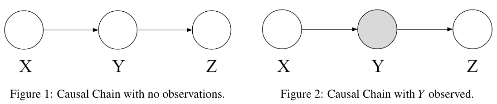
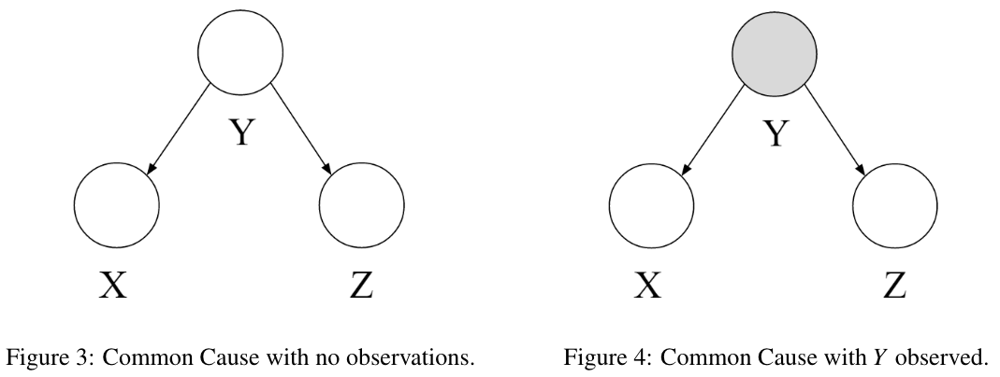
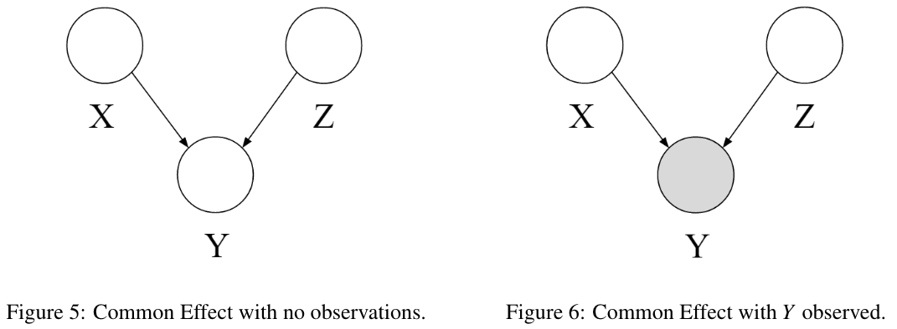
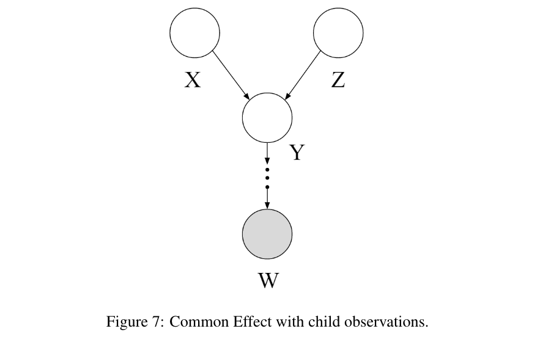
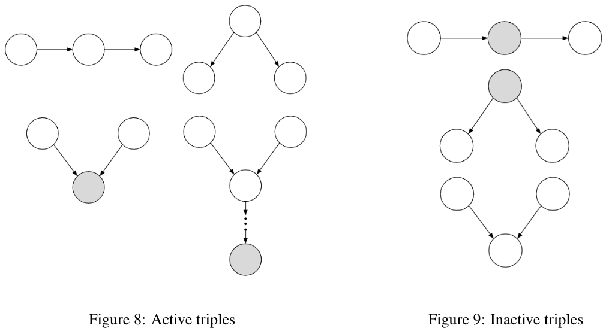
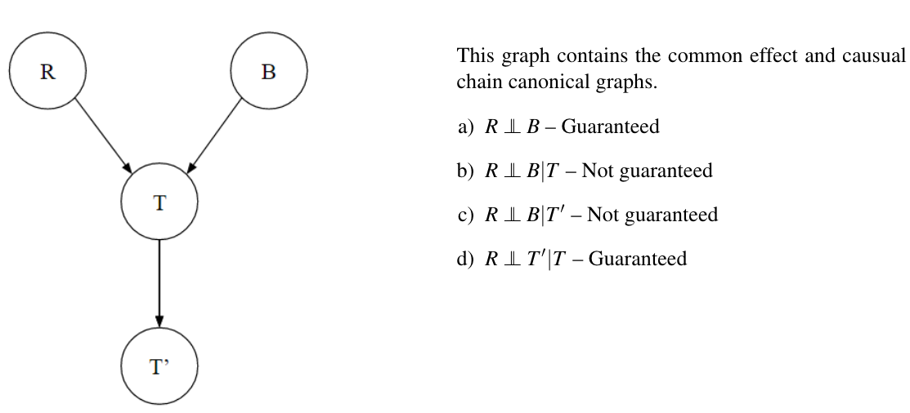
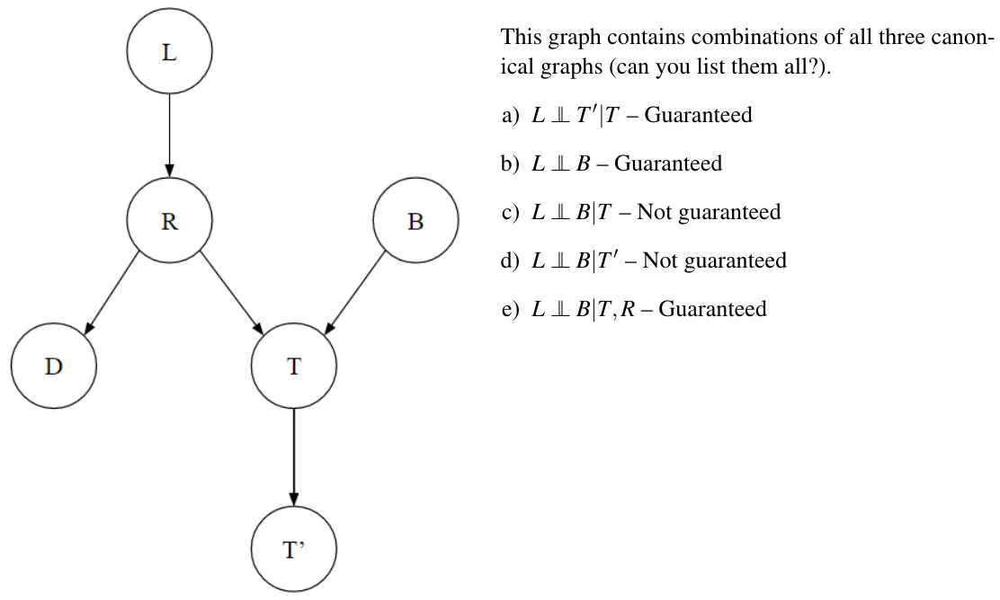
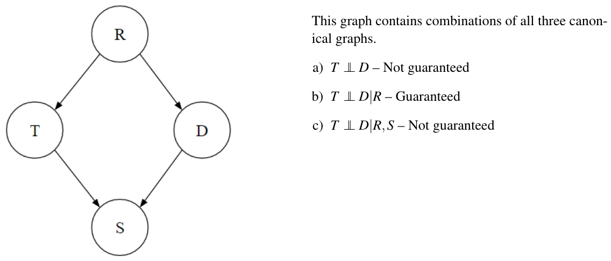

# BN: Independence

## D-Separation

**A node is conditionally independent of all its ancestor nodes in the graph given all of its parents.**

### Causal Chains

{width=100%}

Figure 1 is a configuration of three nodes known as a **causal chain**.

$$
P(x, y, z)=P(z \mid y) P(y \mid x) P(x)
$$

X and Z are not guaranteed to be independent.

However, we can make the statement that $X \newcommand{\indep}{\perp \!\!\! \perp} \indep Z \mid Y$.

$$
\begin{aligned}
P(X \mid Z, y) & =\frac{P(X, Z, y)}{P(Z, y)}=\frac{P(Z \mid y) P(y \mid X) P(X)}{\sum_x P(X, y, Z)}=\frac{P(Z \mid y) P(y \mid X) P(X)}{P(Z \mid y) \sum_x P(y \mid x) P(x)} \\
& =\frac{P(y \mid X) P(X)}{\sum_x P(y \mid x) P(x)}=\frac{P(y \mid X) P(X)}{P(y)}=P(X \mid y)
\end{aligned}
$$

#### 例子

未观察中间节点：

- 你有一个朋友 $Y$, 他受你的情绪 $X$ 影响（如果你开心, 他也开心）, 同时他也会影响他家里的宠物 $Z$ (他开心时宠物也高兴)。
- 如果你不知道朋友 $Y$ 的情绪, 你只能猜测你自己的情绪可能通过朋友影响到了宠物。因此, $X$ 和 $Z$ 之间有一种关联。

观察中间节点：

- 现在, 你知道了朋友 $Y$ 的情绪。无论你如何情绪, 你只需要看朋友的情绪来判断宠物的状态。因此, 知道了 $Y$ 之后, $X$ 和 $Z$ 之间就没有直接关系了。

### Common Cause

{width=100%}

$$
P(x, y, z)=P(x \mid y) P(z \mid y) P(y)
$$

X is not guaranteed to be independent of Z.

$X \indep Z \mid Y$: X and Z are independent if Y is observed.

$$
P(X \mid Z, y)=\frac{P(X, Z, y)}{P(Z, y)}=\frac{P(X \mid y) P(Z \mid y) P(y)}{P(Z \mid y) P(y)}=P(X \mid y)
$$

#### 例子

- 假设 $Y$ 是天气, $X$ 是人们是否带伞, $Z$ 是地面是否湿滑。天气影响人们是否带伞（如果天气预报下雨, 人们会带伞), 也影响地面是否湿滑（如果下雨, 地面会湿滑)。
- 如果你不知道天气（未观察 $Y$ ), 你可能会发现带伞和地面湿滑之间有某种关联（因为它们都受天气影响)。
- 但如果你知道天气情况 (观察 $Y$ ), 比如知道今天下雨, 那么带伞和地面湿滑的关系就变得独立了 (知道了天气, 你不需要通过看地面来判断是否需要带伞)。

### Common Effect

{width=100%}

$$
P(x, y, z)=P(y \mid x, z) P(x) P(z)
$$

In the configuration shown in Figure 5, X and Z are independent: $X \indep Z$

However, they are not necessarily independent when conditioned on Y.

Example:

$$
\begin{aligned}
& P(X=\text { true })=P(X=\text { false })=0.5 \\
& P(Z=\text { true })=P(Z=\text { false })=0.5
\end{aligned}
$$

and $Y$ is determined by whether $X$ and $Z$ have the same value:

$$
P(Y \mid X, Z)= \begin{cases}1 & \text { if } X=Z \text { and } Y=\text { true } \\ 1 & \text { if } X \neq Z \text { and } Y=\text { false } \\ 0 & \text { else }\end{cases}
$$

Then X and Z are independent if Y is unobserved. But if Y is observed, then knowing X tells you about Z. So X and Z are
not conditionally independent given Y.

This same logic applies when conditioning on descendants of Y in the graph. If one of Y’s descendant nodes is observed, as in Figure 7, X and Z are not guaranteed to be independent.

{width=100%}

### General Case, and D-Separation

We formulate the problem as follows:

!!! question "Problem"
    Given a Bayes Net $G$, two nodes $X$ and $Y$, and a (possibly empty) set of observed nodes
    $\left \{ Z_1, \dots, Z_k \right \}$, must the following statement be true:
    $X \indep Y \mid \left \{ Z_1, \dots, Z_k \right \}$?
    
**D-Separation**(Directed Separation): If a set of variables $Z_1, \dots, Z_k$ d-separates $X$ and $Y$, then $X \indep Y \mid \left \{ Z_1, \dots, Z_k \right \}$. in all possible distributions that can be encoded by the Bayes Net.

!!! note "D-Separation Algorithm"
    1. Shade all observed nodes $\left\{Z_1, \ldots, Z_k\right\}$ in the graph.
    2. Enumerate all undirected paths from $X$ to $Y$.
    3. For each path:
        1. Decompose the path into triples (segments of 3 nodes).
        2. If **all triples are active**, this path is active and *d-connects* $X$ to $Y$.
    4. If **no path** d-connects $X$ and $Y$, then $X$ and $Y$ are d-separated, so they are conditionally independent given $\left\{Z_1, \ldots, Z_k\right\}$

Any path in a graph from X to Y can be decomposed into a set of 3 consecutive nodes and 2 edges - each of which is called a triple.

A triple is active or inactive depending on whether or not the middle node is observed.

{width=100%}

### Examples

{width=100%}

{width=100%}

{width=100%}