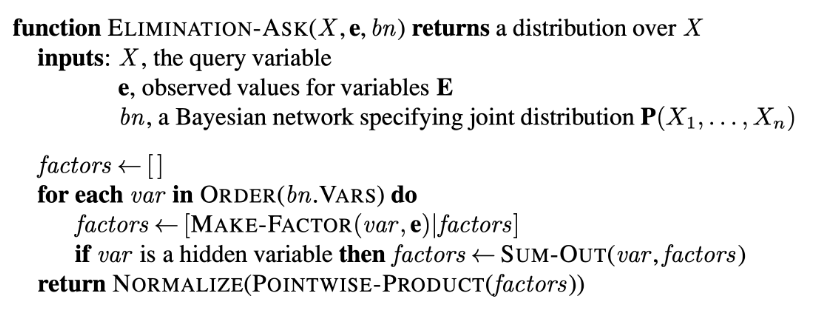
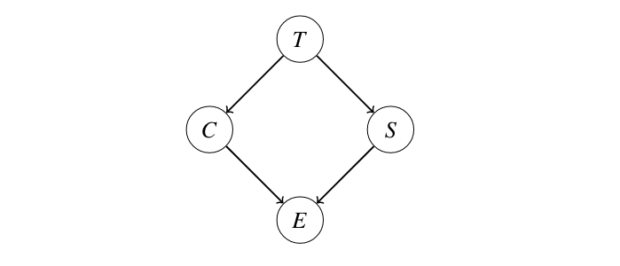

# BN: Inference

## Exact Inference in Bayes Nets

Inference is the problem of finding the value of some probability distribution $P(Q_1 \ldots Q_m \mid e_1 \ldots e_n)$.

Given a Bayes Net, we can solve this problem naively by forming the joint PDF and using Inference by Enumeration. 
This requires the creation of and iteration over an exponentially large table.

### Variable Elimination

An alternate approach is to eliminate hidden variables one by one.

To **eliminate** a variable $X$:

1. Join (multiply together) all factors involving $X$.
2. Sum out (marginalize) $X$.

A **factor** is defined simply as an *unnormalized probability*.

!!! quote "Variable elimination algorithm for inference in Bayes networks"
    {width=100%}

#### Example

Suppose we have a model as shown below, where T , C, S, and E can take on binary values, as shown below. Here, T represents the chance that an adventurer takes a treasure, C represents the chance that a cage falls on the adventurer given that he takes the treasure, S represents the chance that snakes are released if an adventurer takes the treasure, and E represents the chance that the adventurer escapes given information about the status of the cage and snakes.

{width=100%}

In this case, we have the factors $P(T), P(C \mid T), P(S \mid T)$, and $P(E \mid C, S)$. Suppose we want to calculate $P(T \mid+e)$. The inference by enumeration approach would be to form the 16 row joint $\operatorname{PDF} P(T, C, S, E)$, select only the rows corresponding to +e, then summing out $C$ and $S$ and finally normalizing.

The alternate approach is to eliminate $C$, then $S$, one variable at a time. We'd proceed as follows:

- Join (multiply) all the factors involving $C$, forming $f_1(C,+e, T, S)=P(C \mid T) \cdot P(+e \mid C, S)$. Sometimes this is written as $P(C,+e \mid T, S)$.
- Sum out $C$ from this new factor, leaving us with a new factor $f_2(+e, T, S)$, sometimes written as $P(+e \mid T, S)$.
- Join all factors involving $S$, forming $f_3(+e, S, T)=P(S \mid T) \cdot f_2(+e, T, S)$, sometimes written as $P(+e, S \mid T)$.
- Sum out $S$, yielding $f_4(+e, T)$, sometimes written as $P(+e \mid T)$.
- Join the remaining factors, which gives $f_5(+e, T)=f_4(+e, T) \cdot P(T)$.

Once we have $f_5(+e, T)$, we can easily compute $P(T \mid+e)$ by normalizing.

An alternate way of looking at the problem is to observe that the calculation of $P(T \mid+e)$ can either be done through inference by enumeration as follows:

$$
\alpha \sum_s \sum_c P(T) P(s \mid T) P(c \mid T) P(+e \mid c, s)
$$

or by Variable elimination as follows:

$$
\alpha P(T) \sum_s P(s \mid T) \sum_c P(c \mid T) P(+e \mid c, s)
$$

As a final note on variable elimination, it’s important to observe that it only improves on inference by enumeration if we are able to limit the size of the largest factor to a reasonable value.