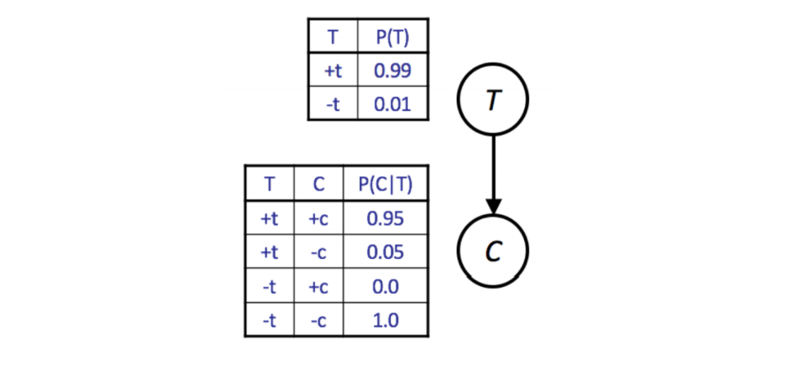
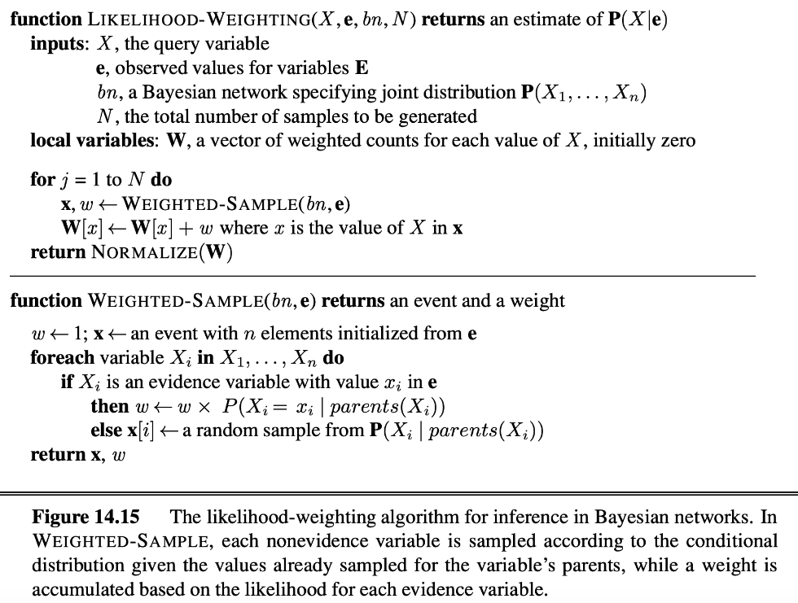
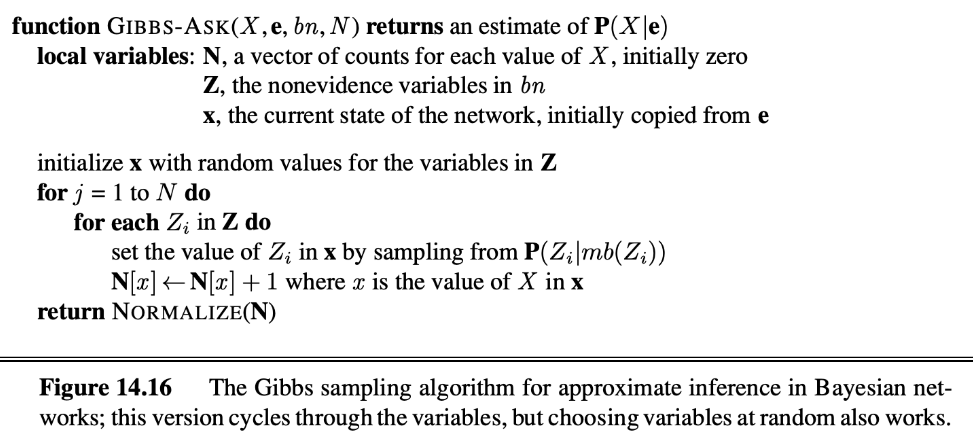

# BN: Sampling

## Approximate Inference in Bayes Nets: Sampling

IBE or Variable Elimination can be computationally expensive when the Bayes Net is large or when the query is complex. 

An alternate approach for probabilistic reasoning is to implicitly calculate the probabilities for our query by simply counting samples.

This will not yield the exact solution, but this approximate inference is often good enough,
especially when taking into account massive savings in computation.

### Prior Sampling

{width=100%}

```py
import random

def get_t():
    if random.random() < 0.99:
        return True
    
    return False

def get_c(t):
    if t and random.random() < 0.95:
        return True

    return False

def get_sample():
    t = get_t()
    c = get_c(t)
    return [t, c]
```

We call this simple approach **prior sampling**. 

The downside of this approach is that it may require the generation of a very large number of samples in order to perform analysis of unlikely scenarios. 
If we wanted to compute $P(C \mid-t)$, we'd have to throw away $99 \%$ of our samples.

### Rejection Sampling

{width=100%}

One way to mitigate the previously stated problem is to modify our procedure to early reject any sample inconsistent with our evidence.  We call this approach **rejection sampling**.

These two approaches work for the same reason: any valid sample occurs with the same probability as specified in the joint PDF.

### Likelihood Weighting

A more exotic approach is **likelihood weighting**.

We manually set the evidence variables to their observed values and then sample the remaining variables.

The problem here is that this may yield samples that are inconsistent with the correct distribution.

Likelihood weighting solves this issue by using a weight for each sample,
which is the probability of the evidence given the sample.

To do this, we iterate through each variable in Bayes Net, sampling a value
if the value is not an evidence variable, or changing the weight for the sample
if the variable is evidence.

!!! quote ""
    {width=100%}

### Gibbs Sampling

!!! note 
    **Gibbs Sampling** is a fourth approach for sampling. In this approach, we first set
    all variables to some totally random values. 
    
    We then repeatedly pick one variable
    at a time, clear its value, and resample it given the values currently assigned to
    other variables.

    If we repeat this process enough times, our later samples will eventually
    converge to the correct distribution even though we may start from a
    low-probability assignment of values.

!!! quote ""
    {width=100%}

## Conclusion

To summarize, **Bayesian Networks is a powerful representation of joint probability distributions**.
**Its topological structure encodes independence and conditional independence relationships,
and we can use it to model arbitrary distributions to perform inference and sampling**.

We covered two approaches to probabilistic inference: exact inference and probabilistic inference (sampling).

In exact inference, we are guaranteed the exact correct probability, but the amount of computation may be prohibitive:

* Inference By Enumeration
* Variable Elimination

We can turn to sampling to approximate solutions while using less computation:

* Prior Sampling
* Rejection Sampling
* Likelihood Weighting
* Gibbs Sampling