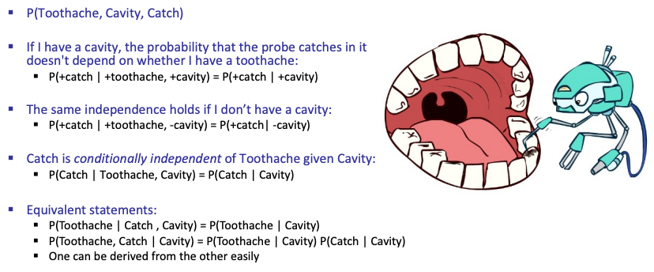

# BN: Representation

只看note的话太难懂了。。。。于是看了Lecture

Fall 2018的老师讲得不错，可以多听听

 Lecture一开始没有直接讲BN，而是先铺垫一些概率论

## Conditional Independence

{width=100%}

这里举了牙痛的例子，有三个变量：Tootheache, Cavity, Catch.

如果我们知道了Cavity，那么Tootheache和Catch就是条件独立的。

* X is conditionally independent of Y given Z: $X \newcommand{\indep}{\perp \!\!\! \perp} \indep Y \mid Z$

if and only if:

$$
\forall x, y, z: P(x, y \mid z)=P(x \mid z) P(y \mid z)
$$

or, equivalently, if and only if

$$
\forall x, y, z: P(x \mid z, y)=P(x \mid z)
$$

总之，unconditional (absolute) independence is very rare.

*Conditional independence* is our most basic and robust form of knowledge about
uncertain environments.

## Bayesian Network Representation

!!! failure "Representing an entire joint distribution in the memory of a computer is impractical for real problems"
    If we have $n$ variables, each of which can take on $k$ values, then we need to store $k^n$ numbers - Impractical
    to store and manipulate.

Bayes nets avoid this issue by taking advantage of the idea of conditional probability.

We formally define a Bayes Net as consisting of:

* A directed acyclic graph of nodes, one per variable $X$.
* A conditional distribution for each node $P(X \mid A_1 \dots A_n)$, where $A_i$ is the $i^{th}$ parent of $X$, 
  stored as a **conditional probability table**.

It's important to remember that edges between Bayes Net nodes do not mean there is specifically a *causal* relationship between those nodes. It just means that there may be *some* relationship between the nodes.
  
Bayes Nets are only a type of model - with good modeling choices they can still be good enough approximations
that they are useful for solving real-world problems.

## Structure of Bayes Nets

Two rules for Bayes Net independences:

* **Each node is conditionally independent of all its ancestor nodes in the graph, given all of its parents.**
* **Each node is conditionally independent of all other variables given its Markov blanket.** A variable's Markov blanket consists of its parents, children, and children's other parents.