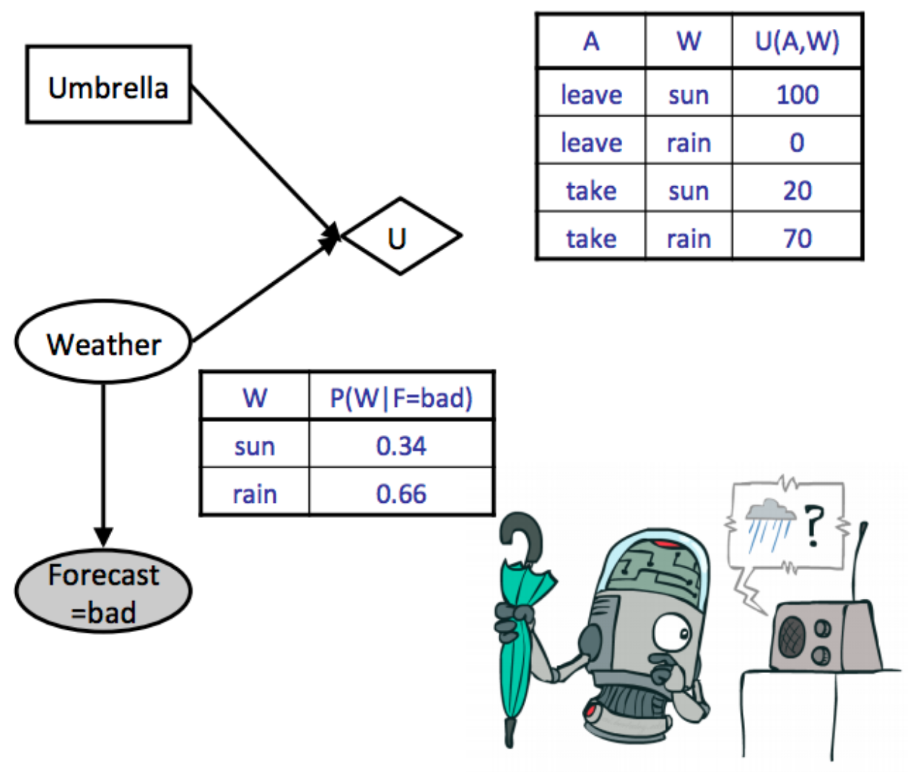
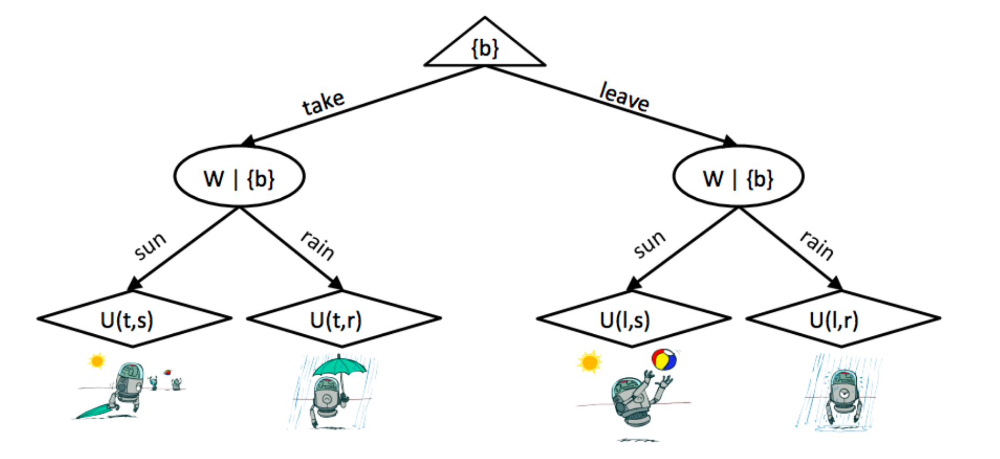

# Decision Networks & VPI

## Utility

### The mathematical language of preferences

* If an agent prefers receiving a prize A to receiving a prize B, this is written $A \succ B$.
* If an agent is indifferent between receiving A or B, this is written as $A \sim B$.
* A **lottery** is a situation with different prizes resulting with different probabilities.

$$
L=[p, A ;(1-p), B]
$$

In order for a set of preferences to be rational, they must follow the five **Axioms of Rationality**:

### Five Axioms of Rationality

* *Orderability*: $(A \succ B) \vee(B \succ A) \vee(A \sim B)$

    A rational agent must either prefer one of A or B, or be indifferent between the two.

* *Transitivity*: $(A \succ B) \wedge(B \succ C) \Rightarrow(A \succ C)$

* *Continuity*: $A \succ B \succ C \Rightarrow \exists p \ [p, A ;(1-p), C] \sim B$

    If a rational agent prefers $A$ to $B$ but $B$ to $C$, then it's possible to construct a lottery $L$ between $A$ and $C$ such that the agent is indifferent between $L$ and $B$ with appropriate selection of $p$.

* *Substitutability*: $A \sim B \Rightarrow[p, A ;(1-p), C] \sim[p, B ;(1-p), C]$

* *Monotonicity*: $A \succ B \Rightarrow(p \geq q) \Leftrightarrow[p, A ;(1-p), B] \succeq[q, A ;(1-q), B]$

    If a rational agent prefers $A$ over $B$, then given a choice between lotteries involving only $A$ and $B$, the agent prefers the lottery assigning the highest probability to $A$.

If all five axioms are satisfied by an agent, then it’s guaranteed that the agent’s behavior is describable as a maximization of expected utility.

$$
\begin{aligned}
U(A) \geq U(B) & \Leftrightarrow A \succeq B \\
U\left(\left[p_1, S_1 ; \ldots ; p_n, S_n\right]\right) & =\sum_i p_i U\left(S_i\right)
\end{aligned}
$$

### Example

Consider the following lottery:

$$
L=[0.5, \$ 0 ; 0.5, \$ 1000]
$$

This represents a lottery where you receive $\$ 1000$ with probability 0.5 and $\$ 0$ with probability 0.5 . 

Now consider three agents $A_1, A_2$, and $A_3$ which have utility functions $U_1(\$ x)=x, U_2(\$ x)=\sqrt{x}$, and $U_3(\$ x)=x^2$ respectively. If each of the three agents were faced with a choice between participating in the lottery and receiving a flat payment of $\$ 500$, which would they choose? 

The respective utilities for each agent of participating in the lottery and accepting the flat payment are listed in the following table:

| Agent | Lottery | Flat Payment |
| ----- | ------- | ------------ |
| 1     | 500     | 500          |
| 2     | 15.81   | 22.36        |
| 3     | 500000  | 250000       |

* Agent $A_1$ is indifferent between participating in the lottery and receiving the flat payment (the utilities for both cases are identical). Such an agent is known as **risk-neutral**. 
* $A_2$ prefers the flat payment to the lottery and is **risk-averse**.
* $A_3$ prefers the lottery to the flat payment and is **risk-seeking**.

## Decision Networks

!!! note
    Now we’ll discuss a combination of both Bayes’ nets and expectimax known as a **decision network** that we can use to model the effect of various actions on utilities based on an overarching graphical probabilistic model.

* **Chance nodes**: Each outcome in a chance node has an associated probability, which can be determined by running inference on the underlying Bayes’ net it belongs to.
* **Action nodes**: Representing a choice between any of a number of actions which we have the power to choose from.
* **Utility nodes**: Output a utility based on the values taken on by their parents.

Our goal with decision networks is again to select the action which yields the **maximum expected utility** (MEU):

* Start by instantiating all evidence that’s known, and run inference to calculate the posterior probabilities.
* Go through each possible action and compute the expected utility of taking that action given the posterior probabilities computed in the previous step.
    $$
    E U(a \mid e)=\sum_{x_1, \ldots, x_n} P\left(x_1, \ldots, x_n \mid e\right) U\left(a, x_1, \ldots, x_n\right)
    $$
* Select the action which yielded the highest utility to get the MEU.

### Example

{width=70%}

$$
\begin{aligned}
E U(\text { leave } \mid \text { bad }) & =\sum_w P(w \mid \text { bad }) U(\text { leave }, w) \\
& =0.34 \cdot 100+0.66 \cdot 0=34 \\
E U(\text { take } \mid \mathrm{bad}) & =\sum_w P(w \mid \text { bad }) U(\text { take }, w) \\
& =0.34 \cdot 20+0.66 \cdot 70=53
\end{aligned}
$$

All that's left to do is take the maximum over these computed utilities to determine the MEU:
$$
\operatorname{MEU}(F=\mathrm{bad})=\max _a E U(a \mid \mathrm{bad})=53
$$

The action that yields the maximum expected utility is *take*.

### Outcome Trees

## The Value of Perfect Information

!!! tip
    One of the most important parts of decision making is knowing whether or not it’s worth
    gathering more evidence to help decide which action to take. 

!!! note "The Value of Perfect Information (VPI)"
    Mathematically quantifies the amount of an agent's maximum expected utility is 
    expected to increase if it observes some new evidence.

### General Formula

We know our current maximum utility given our current evidence $e$:

$$
\operatorname{MEU}(e)=\max _a \sum_s P(s \mid e) U(s, a)
$$

Additionally, we know that if we observed some new evidence $e^{\prime}$ before acting, the MEU of our action at that point would become

$$
\operatorname{MEU}\left(e, e^{\prime}\right)=\max _a \sum_s P\left(s \mid e, e^{\prime}\right) U(s, a)
$$

However, note that **we don't know what new evidence we'll get**. For example, if we didn't know the weather forecast beforehand and chose to observe it, the forecast we observe might be either good or bad. Because we don't know what what new evidence $e^{\prime}$ we'll get, we must represent it as a random variable $E^{\prime}$. How do we represent the new MEU we'll get if we choose to observe a new variable if we don't know what the evidence gained from observation will tell us? The answer is to compute the expected value of the maximum expected utility which, while being a mouthful, is the natural way to go:

$$
\operatorname{MEU}\left(e, E^{\prime}\right)=\sum_{e^{\prime}} P\left(e^{\prime} \mid e\right) M E U\left(e, e^{\prime}\right)
$$

Returning to our definition for VPI, we want to find the amount our MEU is expected to increase if we choose to observe the new evidence $E^{\prime}$:

$$
V P I(E^{\prime} \mid e)= \operatorname{MEU}(e, E^{\prime})-\operatorname{MEU}(e)
$$

### Properties of VPI

* **Nonnegativity**: $\forall E^{\prime}, e \quad V P I(E^{\prime} \mid e) \geq 0$
* **Nonadditivity**: $V P I\left(E_j, E_k \mid e\right) \neq V P I\left(E_j \mid e\right)+V P I\left(E_k \mid e\right)$
    Generally  observing some new evidence $E_j$ might change how much we care about
    $E_k$; therefore we can't simply add
* **Order-independence**: $V P I\left(E_j, E_k \mid e\right)=V P I\left(E_j \mid e\right)+V P I\left(E_k \mid e, E_j\right)=V P I\left(E_k \mid e\right)+V P I\left(E_j \mid e, E_k\right)$
    Observing multiple new evidences yields the same gain in maximum expected utility regardless of the order of observation.