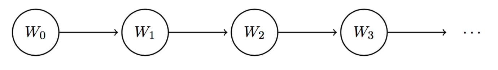
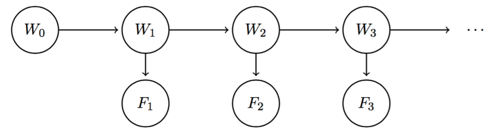

# Hidden Markov Models

## Markov Models

Markov model can be thought of as analogous to a chain-like, infinite-length
Bayes' net.

Our weather model will be time-dependent (as are Markov models in general)

{width=100%}

To track how our quantity under consideration changes over time,
we need to know the following:

* **Initial Distribution**: The probability of the quantity at time 0.
* **Transition Model**: The probability of moving from one state to another between time steps.

The weather at time $t = i + 1$ satisfies the **Markov Property** or 
**memoryless property**, and is independent of the weather at all other 
timesteps besides $t = i$.

Markov models make the following assumptions:

$$
W_{i+1} \newcommand{\indep}{\perp \!\!\! \perp} \indep \left\{W_0, \ldots, W_{i-1}\right\} \mid W_i
$$

This allows us to reconstruct the joint distribution:

$$
P\left(W_0, W_1, \ldots, W_n\right)=P\left(W_0\right) P\left(W_1 \mid W_0\right) P\left(W_2 \mid W_1\right) \ldots P\left(W_n \mid W_{n-1}\right)=P\left(W_0\right) \prod_{i=0}^{n-1} P\left(W_{i+1} \mid W_i\right)
$$

A final assumption is that the transition model is **stationary**, meaning that for all values of $i$ (all time steps):
$P\left(W_{i+1} \mid W_i\right)$ is identical.

### The Mini-Forward Algorithm

By properties of marginalization, we know that

$$
P\left(W_{i+1}\right)=\sum_{w_i} P\left(w_i, W_{i+1}\right)
$$

By the chain rule we can re-express this as follows:

$$
P\left(W_{i+1}\right)=\sum_{w_i} P\left(W_{i+1} \mid w_i\right) P\left(w_i\right)
$$

With this equation, we can iteratively compute the distribution of the weather
at any time step by starting with the initial distribution $P\left(W_0\right)$
and using it to compute $P\left(W_1\right)$, and so on.

### Stationary Distribution

!!! question
    Does the probability of being in a state at a given timestep ever converge?

To solve the problem above, we must compute the **stationary distribution** of the Markov model. 

$$
P\left(W_{t+1}\right)=P\left(W_t\right)=\sum_{w_t} P\left(W_{t+1} \mid w_t\right) P\left(w_t\right)
$$

## Hidden Markov Models

**Hidden Markov Models** allows us to observe some evidence at each time step,
which can potentially affect the belief distribution at each of the states.

{width=100%}

### The Forward Algorithm

### Viterbi Algorithm