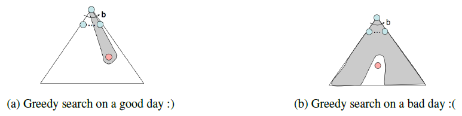
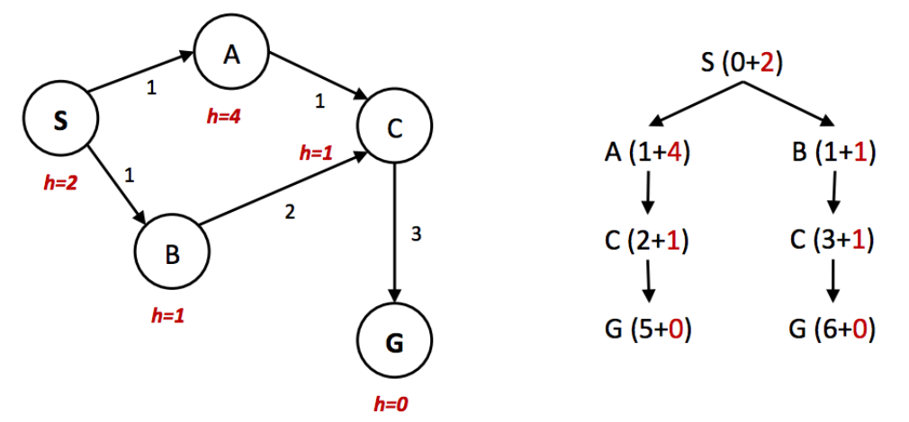
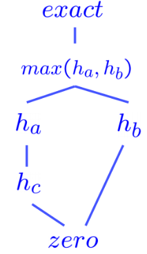

# Informed Search

!!! tip
    If we have some notion of the direction in which we
    should focus our search, we can significantly improve
    performance and "hone in" on a goal much more quickly.
    This is the exactly the focus of **informed search**.

## Heuristics

Heuristics are the driving force that allow estimation of
distance to goal states - they're functions that take in a
state as input and output a corresponding estimate.

## Greedy Search

* *Description*: Always selects the frontier node with the
  *lowest heuristic value* for expansion, which corresponds
  to the state it believes is nearest to the goal.
* *Frontier Representation*: priority queue
* *Completeness and Optimality*: Greedy search is neither
  complete nor optimal.

{width="700"}

## A* Search

* *Description*: Always selects the frontier node with the
  *lowest estimated total cost* for expansion
    * A* combines the total backward cost (sum of edge
      weights in the path to the state) used by UCS
      with the estimated forward cost (heuristic value)
      used by greedy search by summing them together,
      effectively yielding an $estimated \ \ total \ \ cost$
      from start to goal.
* *Frontier Representation*: priority queue
* *Completeness and Optimality*: A* is both complete and
  optimal given an appropriate heuristic.

## Admissibility and Consistency

!!! question "What makes a heuristic good?"

* $g(n)$ - The function representing total backwards cost
  computed by UCS.
* $h(n)$ - The *heuristic value* function, or estimated forward
  cost, used by greedy search.
* $f(n) = g(n) + h(n)$ - The function representing the
  estimated total cost used by A*.

The condition required for optimality when using A\* **tree search**
is known as **admissibility**. Defining $h^*(n)$ as the true optimal
forward cost to reach a goal state a given node $n$, 
we can formulate the adimissibility constraint as:

$$
\forall n, \quad 0 \leq h(n) \leq h^*(n)
$$

!!! quote "Theorem"
    For a given search problem, if the admissibility constraint is satisfied
    by a heuristic function $h$, using A\* **tree search** with $h$ on that 
    search problem will yield an optimal solution.

An additional **caveat of graph search** is that it tends to ruin the
optimality of A*, even under admissible heuristics. 请看下面的例子：

{width="1000"}

可以看到，左边的图片的$h(n)$是admissible的，但是右图说明，在graph search中使用这个heuristic会导致A\*没有找到最优解。

明显的问题是，我们的heuristic并没有对edge的cost作出合理的估计(在左图中，$h(A) - h(S) = 2 \gt cost(S, A) = 1$)

So here comes the concept of **consistency**. Consistency is a stronger condition that encompasses 
admissibility and adds additional requirements. 

**Consistency**: We enforce not only that a heuristic underestimates
the total distance to a goal from any given state, but also the cost/weight
of each edge in the graph. The consistency constraint is formulated as:

$$
\forall A,\ C \quad h(A) - h(C) \leq cost(A, C)
$$

!!! quote "Theorem"
    For a given search problem, if the **consistency constraint** is satisfied
    by a heuristic function $h$, using A\* **graph search** with $h$ on that 
    search problem will yield an optimal solution.

**Important Note**: 

* For heuristic that are either admissible or consistent to be valid,
  it must by definition be the case that $\forall goal, \ \ h(goal) = 0$.
* Consistency *implies* admissibility: if no edge costs are overestimated
  (as guaranteed by consistency), the total estimated cost from any node
  to the goal will also be underestimated.

## Dominance

The standard metric for comparing heuristics is the concept of **dominance**.

If heuristic a is dominant over heuristic b, then the estimated goal distance
for a is greater than the estimated goal distance for b for every node in the 
state space graph.

$$
\forall n, \quad h_a(n) \geq h_b(n)
$$

> The **trivial heuristic** is defined as $h(n) = 0$ for all $n$, reducing A* to UCS.

{width="140"}

!!! tip "Common Practice"
    Generate multiple admisible/consistent heuristics for any given search
    problem and compute the max over the values output by them
    to generate a heuristic that dominates (and hence is better than) all
    of them.

## Search: Summary

* Search problem. Their components: *state space*, *actions*, *transition function*,
  *action cost*, *start state*, *goal state*.
* Rationality: The agent seeks to maximize their expected utility.
* Use PEAS to define the task environment.
* Uninformed search: BFS, DFS, UCS.
* Informed search: Greedy search, A* search.