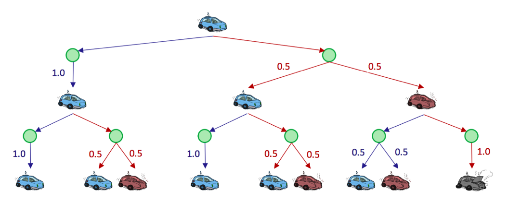

# Markov Decision Processes

## Non-Deterministic Search

In the first note, we talked about traditional search problems and how to solve them; then, in the third note, we changed our model to account for adversaries and other agents in the world that influenced our path to goal states.

Now, we’ll change our model again to account for another influencing factor – the dynamics of world itself. The environment in which an agent is placed may subject the agent’s actions to being **nondeterministic**, which means that there are multiple possible successor states that can result from an action taken in some state.

Such problems where the world poses a degree of uncertainty are known as **nondeterministic search problems**, and can be solved with models known as **Markov decision processes**, or MDPs.

## Markov Decision Processes

A Markov Decision Process is defined by several properties:

- A set of states $S$. States in MDPs are represented in the same way as states in traditional search problems.
- A set of actions $A$. Actions in MDPs are also represented in the same way as in traditional search problems.
- A start state.
- Possibly one or more terminal states.
- Possibly a **discount factor $\gamma$.** 
- A **transition function** $T\left(s, a, s^{\prime}\right)$. Since we have introduced the possibility of nondeterministic actions, we need a way to delineate the likelihood of the possible outcomes after taking any given action from any given state. The transition function for a MDP does exactly this - it's a probability function which represents the probability that an agent taking an action $a \in A$ from a state $s \in S$ ends up in a state $s^{\prime} \in S$.
- A **reward function** $R\left(s, a, s^{\prime}\right)$. Typically, MDPs are modeled with small "living" rewards at each step to reward an agent's survival, along with large rewards for arriving at a terminal state. Rewards may be positive or negative depending on whether or not they benefit the agent in question, and the agent's objective is naturally to acquire the maximum reward possible before arriving at some terminal state.

We represent the movement of an agent through different MDP states over time with discrete **timesteps**, defining $s_t \in S$ and $a_t \in A$ as the state in which an agent exists and the action which an agent takes at timestep $t$ respectively. An agent starts in state $s_0$ at timestep 0 , and takes an action at every timestep. The movement of an agent through a MDP can thus be modeled as follows:

$$
s_0 \xrightarrow{a_0} s_1 \xrightarrow{a_1} s_2 \xrightarrow{a_2} s_3 \xrightarrow{a_3} \ldots
$$

Additionally, knowing that an agent’s goal is to maximize it’s reward across all timesteps, we can correspondingly express this mathematically as a maximization of the following utility function:

$$
U\left(\left[s_0, a_0, s_1, a_1, s_2, \ldots\right]\right)=R\left(s_0, a_0, s_1\right)+R\left(s_1, a_1, s_2\right)+R\left(s_2, a_2, s_3\right)+\ldots
$$

Markov decision processes, like state-space graphs, can be unraveled into search trees. Uncertainty is modeled in these search trees with **Q-states**, also known as **action states**. The Qstate represented by having taken action $a$ from state $s$ is notated as the tuple $(s, a)$.

{width=100%}

The green nodes represent Q-states, where an action has been taken from a state but has yet to be resolved into a successor state.

### Finite Horizons and Discounting

An MDP enforcing a **finite horizon** is simple - it essentially defines a "lifetime" for agents, which gives them some set number of timesteps $n$ to accrue as much reward as they can before being automatically terminated.

**Discount factors** are introduced to model an exponential decay in the value of rewards over time. Concretely, with a discount factor of $\gamma$, taking action $a_t$ from state $s_t$ at timestep $t$ and ending up in state $s_{t+1}$ results in a reward of $\gamma^t R\left(s_t, a_t, s_{t+1}\right)$ instead of just $R\left(s_t, a_t, s_{t+1}\right)$. Now, instead of maximizing the **additive utility**

$$
U\left(\left[s_0, a_0, s_1, a_1, s_2, \ldots\right]\right)=R\left(s_0, a_0, s_1\right)+R\left(s_1, a_1, s_2\right)+R\left(s_2, a_2, s_3\right)+\ldots
$$

we attempt to maximize **discounted utility**

$$
U\left(\left[s_0, a_0, s_1, a_1, s_2, \ldots\right]\right)=R\left(s_0, a_0, s_1\right)+\gamma R\left(s_1, a_1, s_2\right)+\gamma^2 R\left(s_2, a_2, s_3\right)+\ldots
$$

Noting that the above definition of a discounted utility function looks similar to a **geometric series** with ratio $\gamma$, we can prove that it's guaranteed to be finite-valued as long as the constraint $|\gamma|<1$ is met :

$$
\begin{aligned}
U\left(\left[s_0, a_0, s_1, a_1, s_2, \ldots\right]\right) &= R\left(s_0, a_0, s_1\right)+\gamma R\left(s_1, a_1, s_2\right)+\gamma^2 R\left(s_2, a_2, s_3\right)+\ldots \\
&= \sum_{t=0}^{\infty} \gamma^t R\left(s_t, a_t, s_{t+1}\right) \leq \sum_{t=0}^{\infty} \gamma^t R_{\max } = \frac{R_{\max}}{1-\gamma}
\end{aligned}
$$

### Markovianess

Markov decision processes are "markovian" in the sense that they satisfy the **Markov property**, or **memoryless property**, which states that the future and the past are conditionally independent, given the present. Intuitively, this means that, if we know the present state, knowing the past doesn’t give us any more information about the future.

$$
\begin{align*}
P(S_{t+1}=s_{t+1} &\mid S_t=s_t, A_t=a_t, S_{t-1}=s_{t-1}, A_{t-1}=a_{t-1}, \ldots, S_0=s_0) \\
&= P(S_{t+1}=s_{t+1} \mid S_t=s_t, A_t=a_t)
\end{align*}
$$

which is "memoryless" in the sense that **the probability of arriving in a state $s^{\prime}$ at time $t+1$ depends only on the state $s$ and action $a$ taken at time $t$, not on any earlier states or actions**. In fact, it is these memoryless probabilities which are encoded by the transition function: $T\left(s, a, s^{\prime}\right)=P\left(s^{\prime} \mid s, a\right)$.

## Solving Markov Decision Processes

Solving a Markov decision process, on the other hand, means finding an optimal **policy $\pi^*: S \rightarrow A$**, a function mapping each state $s \in S$ to an action $a \in A$. An explicit policy $\pi$ defines a reflex agent - given a state $s$, an agent at $s$ implementing $\pi$ will select $a=\pi(s)$ as the appropriate action to make without considering future consequences of its actions. An optimal policy is one that if followed by the implementing agent, will yield the maximum expected total reward or utility.

### The Bellman Equation

We must first introduce two new mathematical quantities:

- The optimal value of a state $s, \  U^*(s) \ \ or \ \  V^*(s)$ - the optimal value of $s$ is the expected value of the utility an optimally-behaving agent that starts in $s$ will receive, over the rest of the agent's lifetime. 
- The optimal value of a Q-state $(s, a), \ Q^*(s, a)$ - the optimal value of $(s, a)$ is the expected value of the utility an agent receives after starting in $s$, taking $a$, and acting optimally henceforth.

Using these two new quantities and the other MDP quantities discussed earlier, the Bellman equation is defined as follows:

$$
U^*(s)=\max _a \sum_{s^{\prime}} T\left(s, a, s^{\prime}\right)\left[R\left(s, a, s^{\prime}\right)+\gamma U^*\left(s^{\prime}\right)\right]
$$

Before we begin interpreting what this means, let's also define the equation for the optimal value of a Q-state (commonly known as an optimal Q-value):

$$
Q^*(s, a)=\sum_{s^{\prime}} T\left(s, a, s^{\prime}\right)\left[R\left(s, a, s^{\prime}\right)+\gamma U^*\left(s^{\prime}\right)\right]
$$

This second definition allows us to reexpress the Bellman equation as

$$
U^*(s)=\max _a Q^*(s, a)
$$

!!! tip
    The Bellman equation is an example of a dynamic programming equation, an equation that decomposes a problem into smaller subproblems via an inherent recursive structure.

从状态$s$出发，采取action $a$，会有多种可能的successor $s'$,  $\left[R\left(s, a, s^{\prime}\right)+\gamma U^*\left(s^{\prime}\right)\right]$ 代表该项表示代理通过首先从$s$采取$a$并到达$s'$，然后在此后采取最佳行动而获得的total utility。
$Q^*(s, a)$对所有可能的$s'$的utility进行加权求和。

从状态$s$开始有多种可能的action $a$，每个action $a$都有对应的$Q^*(s, a)$，$U^*(s)$选择了最大的那个。

### Value Iteration

**Value iteration** is a **dynamic programming** algorithm that uses an iteratively longer time limit to compute time-limited values until convergence. It operates as follows:

1. $\forall s \in S$, initialize $U_0(s)=0$.
2. Repeat the following update rule until convergence:

$$
\forall s \in S, U_{k+1}(s) \leftarrow \max _a \sum_{s^{\prime}} T\left(s, a, s^{\prime}\right)\left[R\left(s, a, s^{\prime}\right)+\gamma U_k\left(s^{\prime}\right)\right]
$$

For conciseness, we frequently denote $U_{k+1}(s) \leftarrow \max _a \sum_{s^{\prime}} T\left(s, a, s^{\prime}\right)\left[R\left(s, a, s^{\prime}\right)+\gamma U_k\left(s^{\prime}\right)\right]$ with the shorthand $U_{k+1} \leftarrow B U_k$, where $B$ is called the Bellman operator. 

### Policy Extraction

Recall that our ultimate goal in solving a MDP is to determine an optimal policy. This can be done once all optimal values for states are determined using a method called **policy extraction**. The intuition behind policy extraction is very simple: if you're in a state $s$, you should take the action $a$ which yields the maximum expected utility.

$$
\forall s \in S, \pi^*(s)=\underset{a}{\operatorname{argmax}} Q^*(s, a)=\underset{a}{\operatorname{argmax}} \sum_{s^{\prime}} T\left(s, a, s^{\prime}\right)\left[R\left(s, a, s^{\prime}\right)+\gamma U^*\left(s^{\prime}\right)\right]
$$

### Q-Value Iteration

**Q-value iteration** is a dynamic programming algorithm that computes time-limited Q-values. It is described in the following equation:

$$
Q_{k+1}(s, a) \leftarrow \sum_{s^{\prime}} T\left(s, a, s^{\prime}\right)\left[R\left(s, a, s^{\prime}\right)+\gamma \max _{a^{\prime}} Q_k\left(s^{\prime}, a^{\prime}\right)\right]
$$

Once we have the optimal Q-values for each state and action, we can then find the policy for a state by simply choosing the action which has the highest Q-value.

### Policy Iteration

**Policy iteration**: an algorithm that maintains the optimality of value iteration while providing significant performance gains. 

1. Define an *initial policy*. This can be arbitrary, but policy iteration will converge faster the closer the initial policy is to the eventual optimal policy.
2. Repeat the following until convergence:

!!! tip ""
    - Evaluate the current policy with **policy evaluation**. For a policy $\pi$, policy evaluation means computing $U^\pi(s)$ for all states $s$, where $U^\pi(s)$ is expected utility of starting in state $s$ when following $\pi$ :

    $$
    U^\pi(s)=\sum_{s^{\prime}} T\left(s, \pi(s), s^{\prime}\right)\left[R\left(s, \pi(s), s^{\prime}\right)+\gamma U^\pi\left(s^{\prime}\right)\right]
    $$

    Define the policy at iteration $i$ of policy iteration as $\pi_i$. Since we are fixing a single action for each state, we no longer need the max operator which effectively leaves us with a system of $|S|$ equations generated by the above rule. Each $U^{\pi_i}(s)$ can then be computed by simply solving this system. Alternatively, we can also compute $U^{\pi_i}(s)$ by using the following update rule until convergence, just like in value iteration:
    $$
    U_{k+1}^{\pi_i}(s) \leftarrow \sum_{s^{\prime}} T\left(s, \pi_i(s), s^{\prime}\right)\left[R\left(s, \pi_i(s), s^{\prime}\right)+\gamma U_k^{\pi_i}\left(s^{\prime}\right)\right]
    $$

    However, this second method is typically slower in practice.

    * Once we've evaluated the current policy, use **policy improvement** to generate a better policy. Policy improvement uses policy extraction on the values of states generated by policy evaluation to generate this new and improved policy:
    
    $$
    \pi_{i+1}(s)=\underset{a}{\operatorname{argmax}} \sum_{s^{\prime}} T\left(s, a, s^{\prime}\right)\left[R\left(s, a, s^{\prime}\right)+\gamma U^{\pi_i}\left(s^{\prime}\right)\right]
    $$

    If $\pi_{i+1}=\pi_i$, the algorithm has converged, 
    
    and we can conclude that $\pi_{i+1}=\pi_i=\pi^*$.

### Summary

- *Value iteration*: Used for computing the optimal values of states, by iterative updates until convergence.
- *Policy evaluation*: Used for computing the values of states under a specific policy.
- *Policy extraction*: Used for determining a policy given some state value function. If the state values are optimal, this policy will be optimal. This method is used after running value iteration, to compute an optimal policy from the optimal state values; or as a subroutine in policy iteration, to compute the best policy for the currently estimated state values.
- *Policy iteration*: A technique that encapsulates both policy evaluation and policy extraction and is used for iterative convergence to an optimal policy. It tends to outperform value iteration, by virtue of the fact that policies usually converge much faster than the values of states.