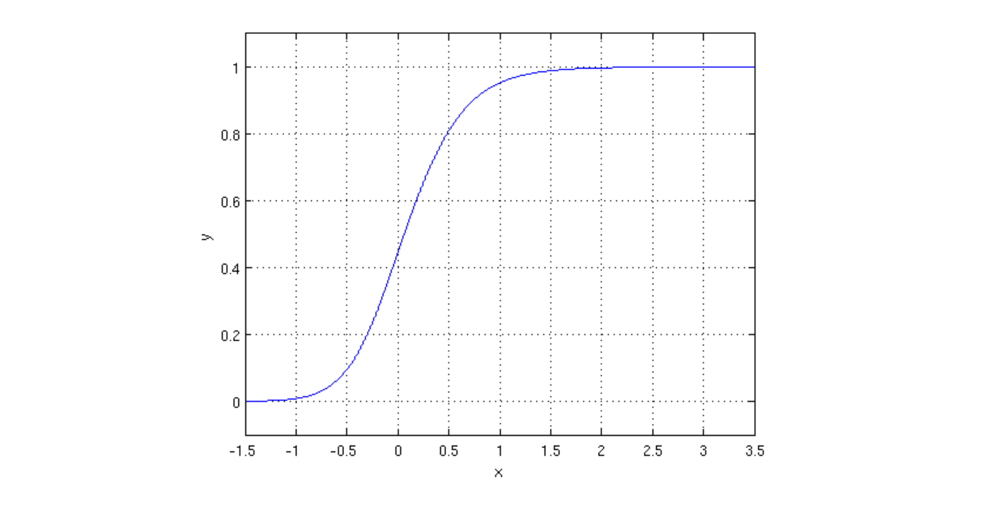

# ML: Logistic Regression

## Logistic Regression

Logistic regression allows us to turn a linear combination of our input features into a probability using the logistic function:

$$
h_{\mathbf{w}}(\mathbf{x})=\frac{1}{1+e^{-\mathbf{w}^T \mathbf{x}}} .
$$

!!! failure "Misnomer"
    Logistic regression is used to solve classification problems, not regression problems.

The logistic function $g(z)=\frac{1}{1+e^{-z}}$ is frequently used to model binary outputs. Note that the output of the function is always between 0 and 1 , as seen in the following figure:

{width=100%}

Intuitively, the logistic function models the probability of a data point belonging in class with label 1. The reason for that is that the **output of the logistic function is bounded between 0 and 1, and we want our model to capture the probability of a feature having a specific label**.

### Multi-Class Logistic Regression

In multi-class logistic regression, we want to classify data points into K distinct categories. We use the **softmax function** in place of the logistic function, which models the probability of a new data point with features $x$ having label $i$ as follows:

$$
P(y=i \mid \mathbf{f}(\mathbf{x}) ; \mathbf{w})=\frac{e^{\mathbf{w}_i^T \mathbf{f}(\mathbf{x})}}{\sum_{k=1}^K e^{\mathbf{w}_k^T \mathbf{f}(\mathbf{x})}}
$$

We estimate the parameters $\mathbf{w}$ to maximize the likelihood that we observed the data.

$$
\ell\left(\mathbf{w}_1, \ldots, \mathbf{w}_K\right)=\prod_{i=1}^n P\left(y_i \mid \mathbf{f}\left(\mathbf{x}_i\right) ; \mathbf{w}\right)
$$