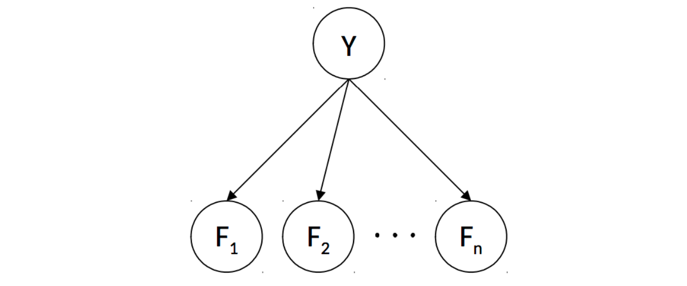
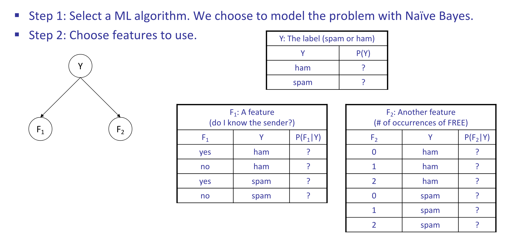
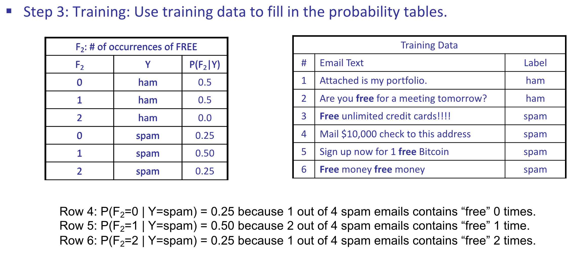
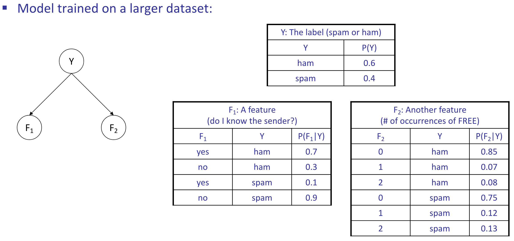
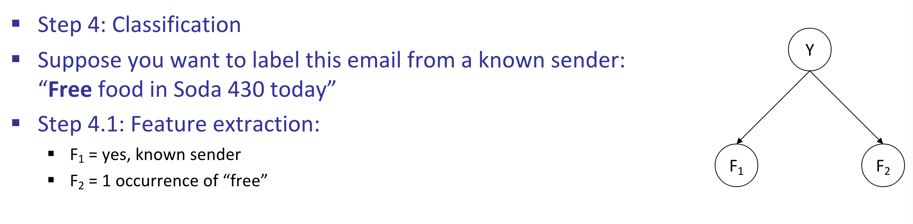
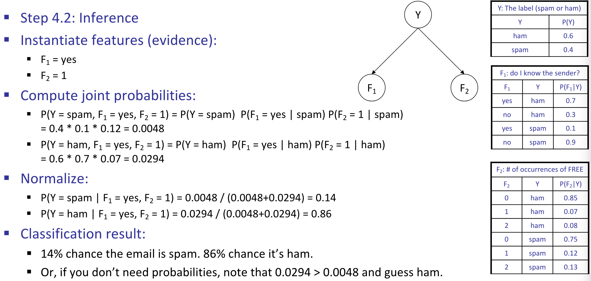

# ML: Naive Bayes

## Machine Learning

!!! note "Machine Learning"
    A broad field of computer science that deals with constructing and/or learning the parameters of a specified model given some data.

Two primary subgroups of machine learning algorithms:

* **Supervised Learning**: Infer a relationship between input data and corresponding
    output data in order to predict outputs for new, previously unseen inputs.
* **Unsupervised Learning**: Given input data that does not have corresponding output data, deal with recognizing inherent structure between or within datapoints and grouping
and/or processing them accordingly.

In this note, the algorithms we’ll discuss will be limited to supervised learning tasks.

Once you have a dataset that you’re ready to learn with, the machine learning process usually involves splitting your dataset into three distinct subsets:

1. **Training Set**: is used to actually generate a model mapping inputs to outputs.
2. **Validation Set**: is used to measure your model’s performance on data it hasn’t seen before, and to tune hyperparameters (parameters that are not learned by the model, but are set by the user).
3. **Test Set**: never seen by your model until the very end of development, and is
   equivalent of a "final exam" to gauge performance on real-world data.

### Naive Bayes

!!! note "Classification Problem"
    Given various data points, our goal is to group them into one of two or more **classes**.
    For classification problems, we're given a training set of data points along with their corresponding **labels**, which are typically one of a few discrete values.

In this section we'll describe how to construct a type of model for solving classification problems known as a **Naive Bayes Classifier**.

In order to learn anything useful, we need to extract certain attributes from
each of them known as **features**. 

The specific features extracted for training are often dependent on the specific problem
you’re trying to solve and which features you decide to select can often impact
the performance of your model dramatically. Deciding which features to utilize is
known as **feature engineering** and is fundamental to machine learning.

{width=100%}

* **Random Variables in this Bayes' net**
    * $Y$: the class label
    * $F_1, F_2, \ldots, F_n$: the features
* **Probability tables in this Bayes’ net**
    * $P(Y)$: Probability of each label occurring, given no information about
the features - known as the **prior**.
    * $P(F_i|Y)$: One table per feature. Probability distribution over a feature given a class label.
* **To perform training**:
    * Use the training dataset to estimate the probability tables.
    * Estimate $P(Y)$: how often does each label occur?
    * Estimate $P(F_i|Y)$: how does the label affect the feature?
* **To perform classification**:
    * Instantiate all features.
    * Query for $P(Y \mid f_1, f_2, \ldots, f_n)$. Probability of each label given the features.

#### Example: Spam Filtering

{width=100%}

{width=100%}
{width=100%}
{width=100%}
{width=100%}
{width=100%}

After noting that our desired probabilities - the probability of each label $y_i$ given
our features, $P\left(Y=y_i \mid F_1=f_1, \ldots, F_n=f_n\right)$ - is proportional to the joint $P\left(Y=y_i, F_1=f_1, \ldots, F_n=f_n\right)$, we can compute:

$$
P\left(Y, F_1=f_1, \ldots, F_n=f_n\right)=\left[\begin{array}{c}
P\left(Y=y_1, F_1=f_1, \ldots, F_n=f_n\right) \\
P\left(Y=y_2, F_1=f_1, \ldots, F_n=f_n\right) \\
\vdots \\
P\left(Y=y_k, F_1=f_1, \ldots, F_n=f_n\right)
\end{array}\right]=\left[\begin{array}{c}
P\left(Y=y_1\right) \prod_i P\left(F_i=f_i \mid Y=y_1\right) \\
P\left(Y=y_2\right) \prod_i P\left(F_i=f_i \mid Y=y_2\right) \\
\vdots \\
P\left(Y=y_k\right) \prod_i P\left(F_i=f_i \mid Y=y_k\right)
\end{array}\right]
$$

Our prediction for class label corresponding to the feature vector $F$ is simply the label corresponding to the maximum value in the above computed vector:

$$
\text { prediction }(F)=\underset{y_i}{\operatorname{argmax}} P\left(Y=y_i\right) \prod_j P\left(F_j=f_j \mid Y=y_i\right)
$$

#### Parameter Estimation

##### Maximum Likelihood for Naive Bayes

##### Smoothing