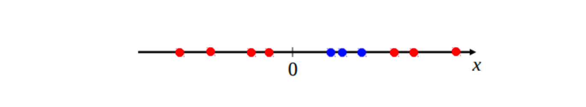
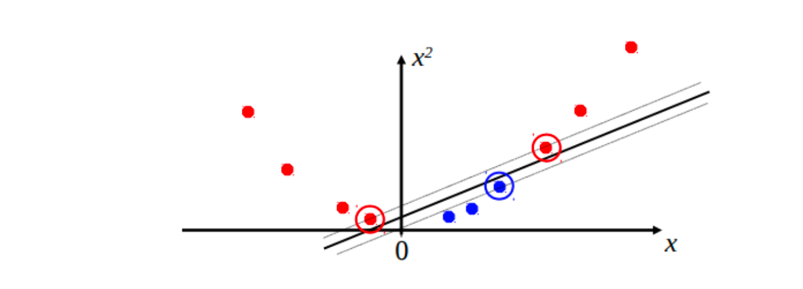
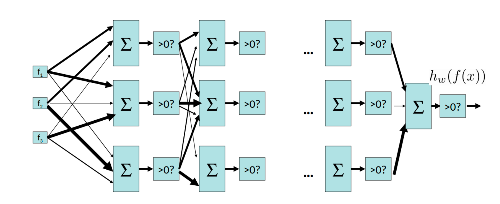

# ML: Neural Networks

## Neural Networks: Motivation

### Non-linear Separators

Many practical problems involve the need for decision boundaries that are nonlinear in nature, and our linear perceptron model isn’t expressive enough to capture this relationship.

Consider the following set of data:

{width=100%}

We would like to separate the two colors, and clearly there is no way this can be done in a single dimension (a single dimensional decision boundary would be a point, separating the axis into two regions). 

!!! tip
    To fix this problem, we can add additional (potentially nonlinear) features to construct a decision boundary from. 

Consider the same dataset with the addition of $x^2$ as a feature:

{width=100%}

Now we were able to fix the problem by mapping our data to a higher dimensional space by manually adding useful features to data points.

A natural desire is to learn these featurization or transformation functions as well, **perhaps using a nonlinear function class that is capable of representing a wider variety of functions**.

### Multi-layer Perceptrons

{width=100%}

In fact, a multi-layer perceptron is a **universal function approximator**
and can represent *any* real function, leaving us only with the problem of 
selecting the best set of weights to parameterize our network.

!!! quote "Theorem - Universal Function Approximators"
    A two-layer neural network with a sufficient number of neurons can approximate any continuous function to any desired accuracy.
    

### Measuring Accuracy

The accuracy of the binary perceptron after making $n$ predictions can be expressed as:

$$
l^{a c c}(\boldsymbol{w})=\frac{1}{n} \sum_{i=1}^n\left(\operatorname{sgn}\left(\boldsymbol{w} \cdot \mathbf{f}\left(\mathbf{x}_i\right)\right)==y_i\right)
$$

In this context, $\operatorname{sgn}(x)$ represents an **indicator function**,
which returns $1$ if $x$ is positive and $-1$ otherwise. We can note that **our accuracy function above is equivalent to dividing the total number of *correct* predictions by the
raw total number of predictions**.

Sometimes, we want an output that is more expressive than a binary label. It then becomes useful to produce a probability for each of the N classes we want to classify into, which reflects our a degree of certainty that the data point belongs to each of the possible classes.

We transition from storing a single weight vector to **storing a weight vector for each class j**, and estimate probabilities with the softmax function. The softmax function defines the probability of classifying $x^{(i)}$ to class $j$ as:

$$
\sigma\left(\mathbf{x}_i\right)_j=\frac{e^{\mathbf{f}\left(\mathbf{x}_i\right)^T \mathbf{w}_j}}{\sum_{\ell=1}^N e^{\mathbf{f}\left(\mathbf{x}_i\right)^T \mathbf{w}_{\ell}}}=P\left(y_i=j \mid \mathbf{f}\left(\mathbf{x}_i\right) ; \mathbf{w}\right)
$$

Given a vector that is output by our function $f$, softmax performs normalization to output a probability distribution. To come up with a general loss function for our models, we can use this probability distribution to generate an expression for the likelihood of a set of weights:

$$
\ell(\boldsymbol{w})=\prod_{i=1}^n P\left(y_i \mid \mathbf{f}\left(\mathbf{x}_i\right) ; \mathbf{w}\right)
$$

This expression denotes the likelihood of a particular set of weights explaining the observed labels and data points. **We would like to find the set of weights that maximizes this quantity.**

### Multi-layer Feedforward Neural Networks

### Loss Functions and Multivariate Optimization

## Neural Networks: Backpropagation

### The Chain Rule

### The Backpropagation Algorithm

## Summary