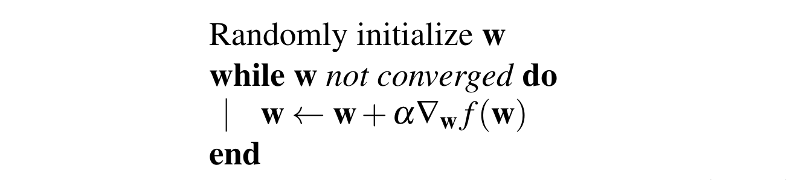
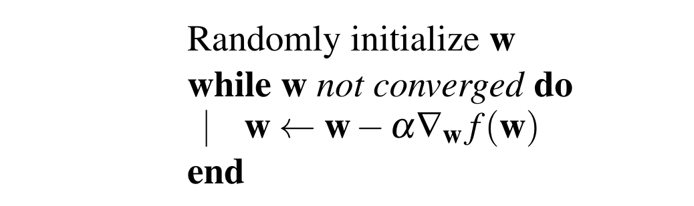

# ML: Optimization

## Optimization

In general though, a closed form solution may not exist for a given objective function. In cases like that we have to use **gradient-based** methods to find the optimal weights.

!!! note
    The idea behind this is that **the gradient points towards the direction of steepest increase of the objective**. We maximize a function by moving towards the steepest **ascent**, and we minimize a function by moving towards the steepest **descent** direction.

**Gradient Ascent** is used if the objective is a function which we want to maximize.

!!! quote ""
    {width=100%}

**Gradient Descent** is used if the objective is a loss function that we are
trying to minimize.
!!! quote ""
    {width=100%}

At the beginning, we initialize the weights randomly. 

We denote the learning rate, which captures the size of the steps we make towards the gradient direction, with $\alpha$.

* **Learning rate decay**: Start gradient descent with a relatively large learning rate
and reduce the learning rate as the number of iterations increases. 

If our dataset has a large number of $n$ data points then computing the gradient
as above in each iteration of the gradient descent algorithm might be too computationally
intensive.

As such, approaches like **stochastic** and **batch gradient descent** have been proposed.