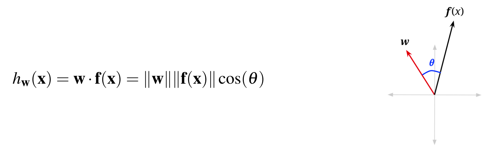
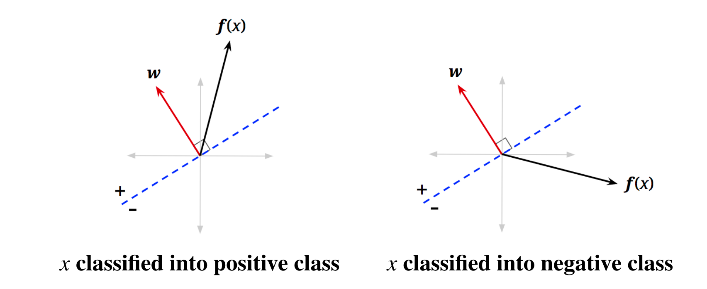
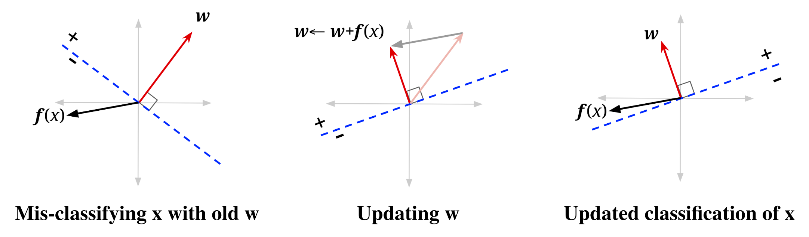
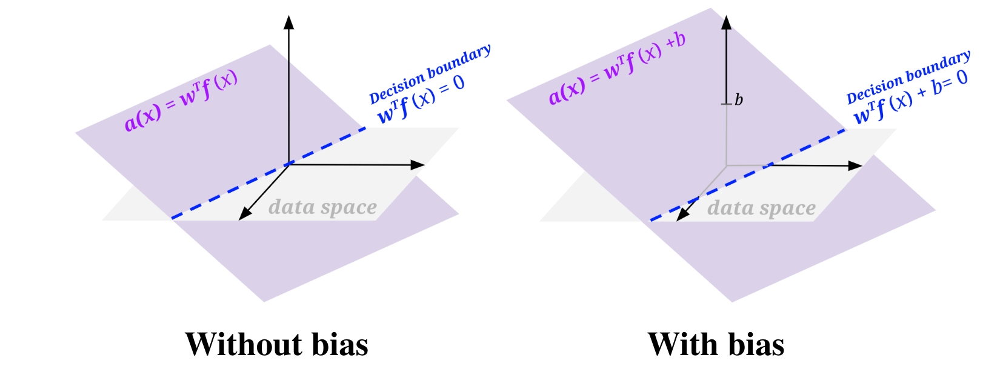
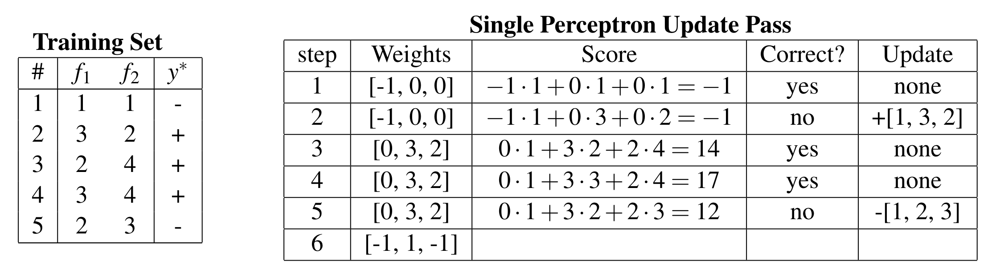

# ML: Perceptrons

## Linear Regression

**Regression problems** are a form of machine learning problem in which the output is a continuous variable (denoted with $y$ ). The features can be either continuous or categorical. We will denote a set of features with $\mathbf{x} \in \mathbb{R}^n$ for $n$ features, i.e. $\mathbf{x}=\left(x_1, \ldots, x_n\right)$.

We use the following linear model to predict the output:

$$
h_{\mathbf{w}}(\mathbf{x})=w_0+w_1 x_1+\cdots w_n x_n
$$

## Perceptrons

### Linear Classifiers

Lets start by looking at a simple linear classifier, which we can use for **binary classification**, which is when the label has two possibilities, positive or negative.

The basic idea of **linear classifiers** is to do classification using a linear combination of the features– a value which we call the **activation**. 

$$
\operatorname{activation}_w(\mathbf{x})=h_{\mathbf{w}}(\mathbf{x})=\sum_i w_i f_i(\mathbf{x})=\mathbf{w}^T \mathbf{f}(\mathbf{x})=\mathbf{w} \cdot \mathbf{f}(\mathbf{x})
$$

$$
\operatorname{classify}(\mathbf{x})= \begin{cases}+ & \text { if } h_{\mathbf{w}}(\mathbf{x})>0 \\ - & \text { if } h_{\mathbf{w}}(\mathbf{x})<0\end{cases}
$$

To understand this geometrically, let us reexamine the vectorized activation function.

{width=100%}

$$
\operatorname{classify}(\mathbf{x})= \begin{cases}+ & \text { if } \theta<\frac{\pi}{2} \\ - & \text { if } \theta>\frac{\pi}{2}\end{cases}
$$

{width=100%}

We call this blue line the **decision boundary** because it is the boundary that separates the region where we classify data points as positive from the region of negatives.
In higher dimensions, a **hyperplane** is a linear surface that is one dimension lower than the latent space, thus dividing the surface in two.

{width=100%}

### Binary Perceptrons

!!! note
    When building a classifier, you start with data, which are labeled with the correct class, we call this the **training set**. You build a classifier by evaluating it
    on the training set, comparing that to your training labels, and 
    adjusting the parameters of your classifier until you reach your goal.

Let’s explore one specific implementation of a simple linear classifier: the binary perceptron.

* The perceptron is a binary classifier - though it can be extended to work on more than
two classes.

The goal of the binary perceptron is to find a decision boundary that perfectly separates the training data.

#### The Algorithm

1. Initialize all weights to 0: $\mathbf{w}=\mathbf{0}$
2. For each training sample, with features $\mathbf{x}$ and true class label
    $y^* \in\{-1,+1\}$, do:
    1. Classify the sample using the current weights

        $$
        y=\operatorname{classify}(x)= \begin{cases}+1 & \text { if } h_{\mathbf{w}}(\mathbf{x})=\mathbf{w}^T \mathbf{f}(\mathbf{x})>0 \\ -1 & \text { if } h_{\mathbf{w}}(\mathbf{x})=\mathbf{w}^T \mathbf{f}(\mathbf{x})<0\end{cases}
        $$
    
    2. Compare the predicted label $y$ to the true label $y^*$:
        * If $y=y^*$, do nothing
        * Otherwise, if $y\neq y^*$, update the weights: $\mathbf{w} \leftarrow \mathbf{w}+y^* \mathbf{f}(\mathbf{x})$

3. If you went through **every** training sample without having to update your weights (all samples predicted correctly), then terminate. Else, repeat step 2.
        
#### Updating weights

Recall that in step 2b above, when our classifier is wrong, the weights vector is updated as follows:

$$
\mathbf{w} \leftarrow \mathbf{w}+y^* \mathbf{f}(\mathbf{x})
$$

1. Mis-classified positive as negative: $\mathbf{w} \leftarrow \mathbf{w}+\mathbf{f}(\mathbf{x})$
2. Mis-classified negative as positive: $\mathbf{w} \leftarrow \mathbf{w}-\mathbf{f}(\mathbf{x})$

!!! question
    Why does this work? 

One way to look at this is to see it as a balancing act.

In case 1, how we adjust $\mathbf{w}$ should strive to fix that and make the activation larger for that training sample.

$$
h_{\mathbf{w}+\mathbf{f}(\mathbf{x})}(\mathbf{x})=(\mathbf{w}+\mathbf{f}(x))^T \mathbf{f}(\mathbf{x})=\mathbf{w}^T \mathbf{f}(\mathbf{x})+\mathbf{f}(\mathbf{x})^T \mathbf{f}(\mathbf{x})=h_{\mathbf{w}}(\mathbf{x})+\mathbf{f}(\mathbf{x})^T \mathbf{f}(\mathbf{x})
$$

!!! question
    While this makes it clear why we are adding and subtracting *something*, why would we want to add and subtract our sample point’s features?

{width=100%}

#### Bias

The problem is, even among problems where there is a linear decision boundary that separates the positive and negative classes in the data, that boundary may not go through the origin, and we want to be able to draw those lines.

#### Example

{width=100%}

$w_0$ is the weight of our bias feature, which is always 1.

### Multiclass Perceptrons

**For the multi-class case, we will have one weight vector for each class**.
In order to classify a sample, we compute a score for each class by taking the dot product of the feature vector with each of the weight vectors. Whichever class yields the highest score is the one we choose as our prediction.

An important thing to note is that in actual implementation, we do not keep track of the weights as separate structures, we usually stack them on top of each other to create a **weight matrix**.

Along with the structure of our weights, our weight update also changes when we move to a multi-class case. If we correctly classify our data point, then do nothing just like in the binary case. If we chose incorrectly, say we chose class $y \neq y^*$, then:

* Add the feature vector to the weight vector for the true class to $y^*$.
* Subtract the feature vector from the weight vector corresponding to the predicted class $y$.

!!! note
    'Rewarding' the correct weight vector, 'punishing' the misleading, incorrect weight vector, and leaving alone an other weight vectors.

## Summary

In this note, we introduced several fundamental principles of machine learning, including:

- Splitting our data into training data, validation data, and test data.
- The difference between supervised learning, which learns from labeled data, and unsupervised learning, which doesn't have labeled data and so attempts to infer inherent structure from it.

We then proceeded to discuss an number of supervised learning algorithms such as Naive Bayes, Linear Regression, and the Perceptron Algorithm.

- We covered the Naive Bayes algorithm and derived the maximum likelihood estimates of the unknown model parameters. We extended this idea to discuss the problem of overfitting in the context of Naive Bayes' and how this issue can be mitigated with Laplace smoothing.
- We talked about Linear Regression, a simple model where we predict real-valued outputs as linear combinations of our input features. 
- Finally, we talked about linear decision boundaries and the perceptron algorithm - a method for classification that repeatedly iterates over all our data and updates weight vectors when it classifies points incorrectly.