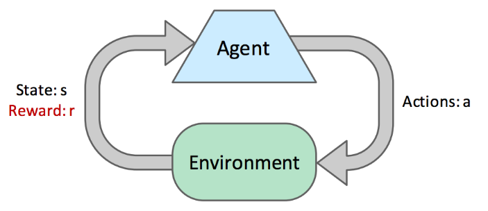
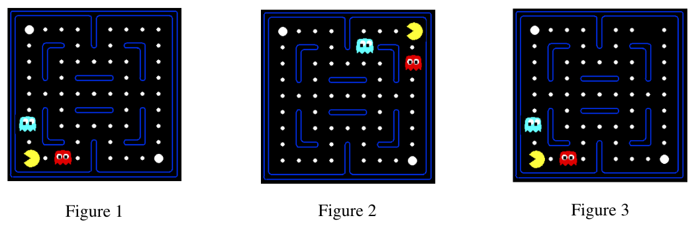

# Reinforcement Learning

Solving Markov decision processes is an example of **offline planning**, where the agents have 
full knowledge of both the **transition** function and the **reward** function, all the information they need to precompute optimal actions in the world encoded by the MDP without ever actually taking any actions.

!!! abstract
    In this note, we will discuss **online planning**, during which an agent has no prior knowledge of rewards or transitions in the world. In online planning, the agent must try **exploration**, during which it performs actions and receive **feedback** in the form of the successor states it arrives and the corresponding rewards it reaps.
The agent uses this feedback to estimate an optimal policy through a process known as **reinforcement learning** 
before using this estimated policy for **exploitation** or reward maximization.

{width=70%}

* Each $\left(s, a, s^{\prime}, r\right)$ tuple is known as a **sample**: an agent in a state $s$ takes an action $a$ and ends up in a successor state $s^{\prime}$, attaining a reward $r$.
* Often, an agent continues to take actions and collect samples in succession until arriving at a terminal state. Such a collection of samples is known as an **episode**.

There are two types of reinforcement learning: **model-based learning** and **model-free learning**.

## Model-Based Learning

Model-based learning attempts to estimate the transition and reward functions with the samples attained during exploration before using these estimates to solve the MDP normally with value or policy iteration.

- Step 1: Learn empirical MDP model
    - Count outcomes s' for each s, a
    - Normalize to give an estimate of $\widehat{T}\left(s, a, s^{\prime}\right)$
    - Discover each $\widehat{R}\left(s, a, s^{\prime}\right)$ when we experience $\left(\mathrm{s}, \mathrm{a}, \mathrm{s}^{\prime}\right)$
- Step 2: Solve the learned MDP
    - For example, use value iteration, as before

By the **law of large numbers**, as we collect more samples by having our agent experience more episodes, our models of $\hat{T}$ and $\hat{R}$ will improve.

## Model-Free Learning

Model-free learning attempts to estimate the values or Q-values of states directly, without ever using any memory to construct a model of the rewards or transitions in the MDP.

Direct evaluation and temporal difference learning fall under a class of algorithms known as **passive reinforcement learning**, where the agent is given a policy to follow and learns the value of states under that policy as it experiences episodes. 

Q-learning falls under a second class of model-free learning algorithms known as **active reinforcement learning**, where the can use the feedback it receives to iteratively update its policy while learning until eventually determining the optimal policy after sufficient exploration.

### Direct Evaluation

!!! example "Idea"
    Fix some policy $\pi$ and have the agent experience several episodes while following $\pi$. 

As the agent collects samples through these episodes it maintains counts of the total utility obtained from each state and the number of times it visited each state. At any point, we can **compute the estimated value of any state $s$ by dividing the total utility obtained from $s$ by the number of times the agent visited $s$**.

Direct evaluation is often unnecessary slow to converge because it wastes information about transitions between states.

### Temporal Difference Learning

!!! example "Idea"
    *Learning from every experience*.

In policy evaluation, we used the system of equations generated by our fixed policy and the Bellman equation to determine the values of states under that policy:

$$
V^\pi(s)=\sum_{s^{\prime}} T\left(s, \pi(s), s^{\prime}\right)\left[R\left(s, \pi(s), s^{\prime}\right)+\gamma V^\pi\left(s^{\prime}\right)\right]
$$

TD learning tries to answer the question of how to compute this weighted average without the weights, cleverly doing so with an **exponential moving average**.

We begin by initializing $\forall s, V^\pi(s)=0$. At each time step, an agent takes an action $\pi(s)$ from a state $s$, transitions to a state $s^{\prime}$, and receives a reward $R\left(s, \pi(s), s^{\prime}\right)$. We can obtain a **sample value** by summing the received reward with the discounted current value of $s^{\prime}$ under $\pi$ :
$$
\text { sample }=R\left(s, \pi(s), s^{\prime}\right)+\gamma V^\pi\left(s^{\prime}\right)
$$

This sample is a new estimate for $V^\pi(s)$. The next step is to incorporate this sampled estimate into our existing model for $V^\pi(s)$ with the exponential moving average:

$$
V^\pi(s) \leftarrow(1-\alpha) V^\pi(s)+\alpha \cdot \text { sample }
$$

Above, $\alpha$ is a parameter constrained by $0 \leq \alpha \leq 1$ known as the **learning rate** that specifies the weight we want to assign our existing model for $V^\pi(s), 1-\alpha$, and the weight we want to assign our new sampled estimate, $\alpha$. It's typical to start out with learning rate of $\alpha=1$, accordingly assigning $V^\pi(s)$ to whatever the first sample happens to be, and slowly shrinking it towards 0 , at which point all subsequent samples will be zeroed out and stop affecting our model of $V^\pi(s)$.

Annotating the state of our model at different points in time:

$$
V_k^\pi(s) \leftarrow(1-\alpha) V_{k-1}^\pi(s)+\alpha \cdot \text { sample }_k
$$

This recursive definition for $V_k^\pi(s)$ happens to be very interesting:

$$
\begin{aligned}
V_k^\pi(s) & \leftarrow(1-\alpha) V_{k-1}^\pi(s)+\alpha \cdot \text { sample }_k \\
V_k^\pi(s) & \leftarrow(1-\alpha)\left[(1-\alpha) V_{k-2}^\pi(s)+\alpha \cdot \text { sample }_{k-1}\right]+\alpha \cdot \text { sample }_k \\
\vdots & \\
V_k^\pi(s) & \leftarrow \alpha \cdot\left[(1-\alpha)^{k-1} \cdot \text { sample }_1+\ldots+(1-\alpha) \cdot \text { sample }_{k-1}+\text { sample }_k\right]
\end{aligned}
$$

This means that **older samples are given exponentially less weight**, exactly what we want since these older samples are
computed using older (and hence worse) version of our model for $V^\pi(s)$.

!!! note "With a single straightforward update rule, we are able to"
    * Learn at every time step
    * Give exponentially less weight to older, less accurate samples
    * Converge to learning true state values much faster

### Q-Learning

As a result, TD learning or direct evaluation are typically used in tandem with some model-based learning to acquire estimates of T and R in order to effectively update the policy followed by the learning agent.

!!! tip "A revolutionary new idea: Q-learning"
    Learning the Q-values of states directly, bypassing the need to ever know any values, transition functions, or reward functions.

As a result, Q-learning is entirely model-free. Q-learning uses the following update rule to perform what's known as $\mathbf{Q}$-value iteration:
$$
Q_{k+1}(s, a) \leftarrow \sum_{s^{\prime}} T\left(s, a, s^{\prime}\right)\left[R\left(s, a, s^{\prime}\right)+\gamma \max _{a^{\prime}} Q_k\left(s^{\prime}, a^{\prime}\right)\right]
$$

With this new update rule under our belt, Q-learning is derived essentially the same way as TD learning, by acquiring $\mathbf{Q}$-value samples:

$$
\text { sample }=R\left(s, a, s^{\prime}\right)+\gamma \max _{a^{\prime}} Q\left(s^{\prime}, a^{\prime}\right)
$$

and incorporating them into an exponential moving average.

$$
Q(s, a) \leftarrow(1-\alpha) Q(s, a)+\alpha \cdot \text { sample }
$$

Q-learning can learn the optimal policy directly even by taking suboptimal or random actions. This is called **off-policy learning** (contrary to direct evaluation and TD learning, which are examples of **on-policy learning**).

### Approximate Q-Learning

{width=100%}

Above, if Pacman learned that Figure 1 is unfavorable after running vanilla Q-learning, it would still have no idea that Figure 2 or even Figure 3 are unfavorable as well. Approximate Q-learning tries to account for this by **learning about a few general situations and extrapolating to many similar situations**. The key to generalizing learning experiences is the **feature-based representation of states**, which represents each state as a vector known as a **feature vector**. For example, a feature vector for Pacman may encode

- the distance to the closest ghost.
- the distance to the closest food pellet.
- the number of ghosts.
- is Pacman trapped? 0 or 1

With feature vectors, we can treat values of states and Q-states as linear value functions:

$$
\begin{aligned}
V(s) & =w_1 \cdot f_1(s)+w_2 \cdot f_2(s)+\ldots+w_n \cdot f_n(s)=\vec{w} \cdot \vec{f}(s) \\
Q(s, a) & =w_1 \cdot f_1(s, a)+w_2 \cdot f_2(s, a)+\ldots+w_n \cdot f_n(s, a)=\vec{w} \cdot \vec{f}(s, a)
\end{aligned}
$$

Defining difference as

$$
\text { difference }=\left[R\left(s, a, s^{\prime}\right)+\gamma \max _{a^{\prime}} Q\left(s^{\prime}, a^{\prime}\right)\right]-Q(s, a)
$$

approximate Q-learning works almost identically to Q-learning, using the following update rule:

$$
w_i \leftarrow w_i+\alpha \cdot \text { difference } \cdot f_i(s, a)
$$

Rather than storing Q-values for each and every state, with approximate Q-learning we **only need to store a single weight vector and can compute Q-values on-demand as needed**. As a result, this gives us not only a more generalized version of Q-learning, but a significantly more memory-efficient one as well.

As a final note on Q-learning, we can reexpress the update rule for exact Q-learning using difference as follows:

$$
Q(s, a) \leftarrow Q(s, a)+\alpha \cdot \text { difference }
$$

This second notation gives us a **slightly different but equally valuable interpretation of the update**: it's computing the difference between the sampled estimated and the current model of $Q(s, a)$, and shifting the model in the direction of the estimate with the magnitude of the shift being proportional to the magnitude of the difference.

## Exploration and Exploitation

We’ll discuss two methods for **distributing time between exploration and exploitation**: $\mathcal{\varepsilon}$-greedy policies and exploration functions.

### $\mathcal{\varepsilon}$-Greedy Policies

!!! note
    Agents following $\varepsilon$-greedy policy define probability $0 \leq \varepsilon \leq 1$, and act randomly and explore with probability $\varepsilon$. They follow current established policy and exploit with probability $(1-\varepsilon)$.

Difficult to handle: $\varepsilon$ must be manually tuned.

### Exploration Functions

This issue of manually tuning $\varepsilon$ is avoided by **exploration functions**:

$$
Q(s, a) \leftarrow(1-\alpha) Q(s, a)+\alpha \cdot\left[R\left(s, a, s^{\prime}\right)+\gamma \max _{a^{\prime}} f\left(s^{\prime}, a^{\prime}\right)\right]
$$

where $f$ denotes an exploration function. There exists some degree of flexibility in designing an exploration function, a common choice is:

$$
f(s, a)=Q(s, a)+\frac{k}{N(s, a)}
$$

with $k$ being some predetermined value, and $N(s, a)$ denoting the number of times Q-state $(s, a)$ has been visited. Agents in a state $s$ always select the action that has the highest $f(s, a)$ from each state, and hence never have to make a probabilistic decision between exploration and exploitation. Instead, **exploration is automatically encoded by the exploration function**, since the term $\frac{k}{N(s, a)}$ can give enough of a "bonus" to some infrequently-taken action such that it is selected over actions with higher Q-values.

## Summary

!!! tip "It’s very important to remember"
    **Reinforcement learning has an underlying MDP**, and **the goal of reinforcement learning is to solve this MDP by deriving an optimal policy**. The difference between using reinforcement learning and using methods like value iteration and policy iteration is the **lack of knowledge** of the transition function T and the reward function R for the underlying MDP. As a result, **agents must learn the optimal policy through online trial-by-error rather than pure offline computation**. There are many ways to do this:

* Model-based learning: Runs computations to estimate the values of the transition function $T$ and the reward function $R$ and uses MDP-solving methods like value or policy iteration with these estimates.
* Model-free learning: Avoids estimating $T$ and $R$
    * On-policy learning: learn the values for a specific policy before deciding whether that policy is suboptimal and needs to be updated.
        * Direct evaluation: follows a policy $\pi$ and simply counts total rewards reaped from each state and the total number of times each state is visited - slow and wasting information about transitions.
        * Temporal difference learning: follows a policy $\pi$ and uses an exponential moving average with sample values until convergence to the true state values under $\pi$.
    * Off-policy learning: learn an optimal policy even when taking suboptimal or random actions.
        * Q-learning: learns the optimal policy directly through trial and error with Q-value iteration updates.
        * Approximate Q-learning: does the same thing as Q-learning but uses a feature-based representation for states to generalize learning.