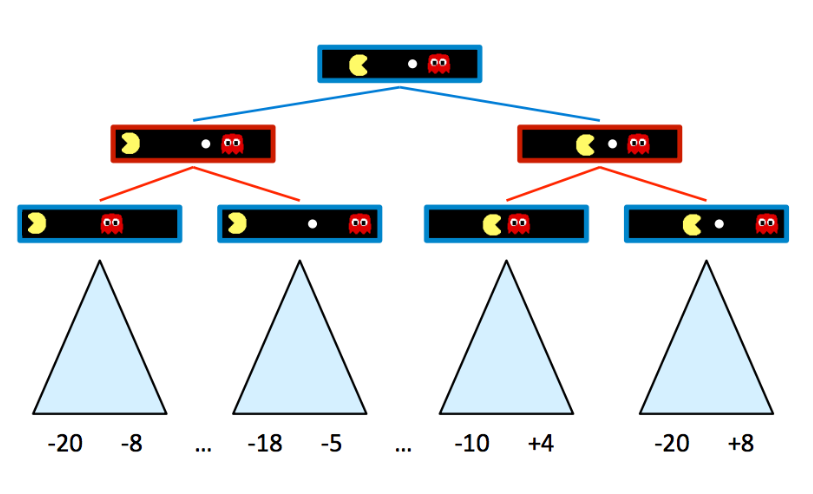
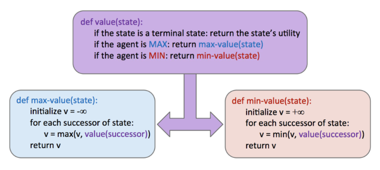
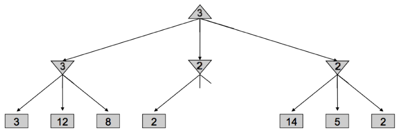
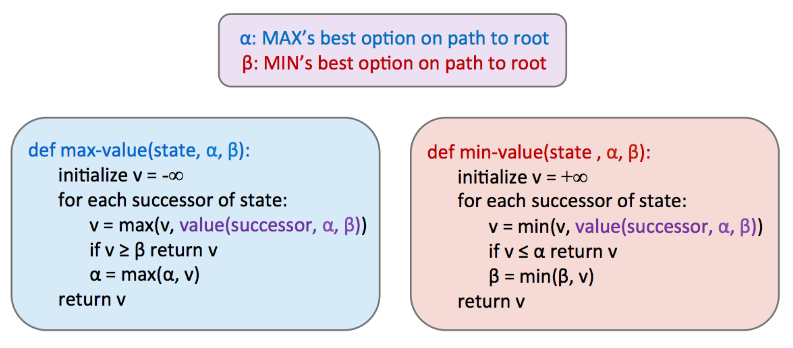
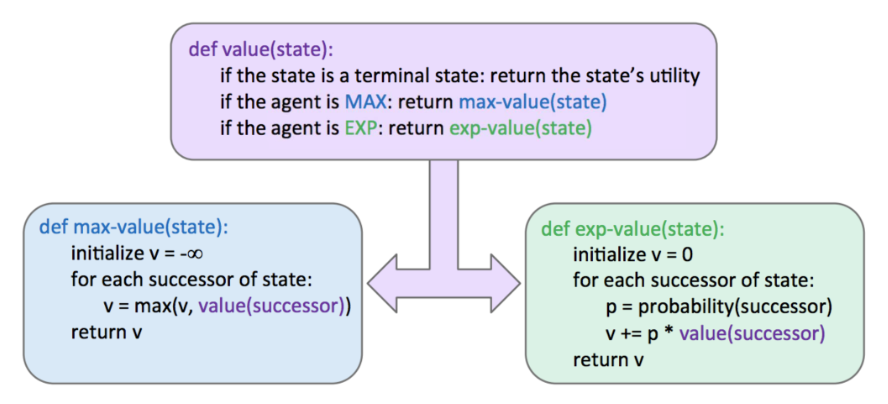
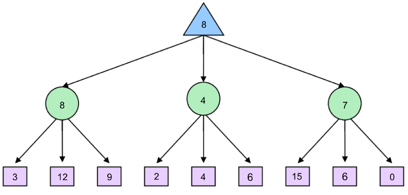
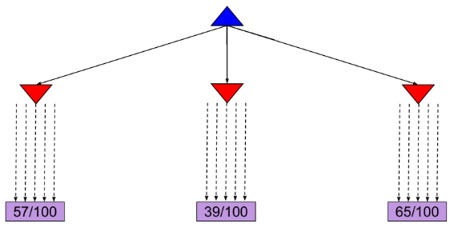
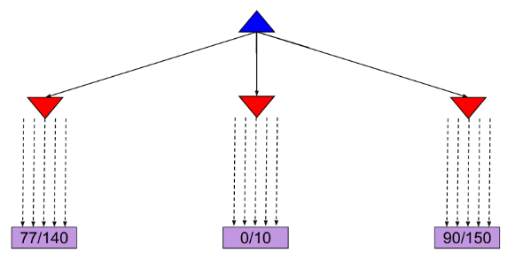
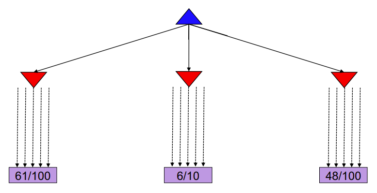
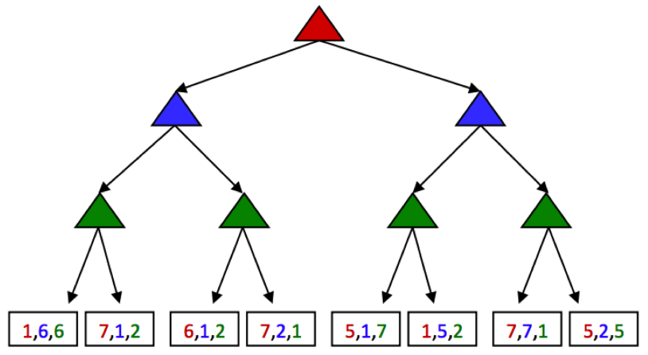

# Search with Other Agents

## Games

**Games**(**Adversarial Search Problems**): our agents have one or more adversaries who attempt to keep them from reaching their goal(s).

The standard game formulation consists of the following definitions:

* Initial state, $s_0$
* Players, $Player(s)$ denote whose turn it is in state $s$
* Action, $Actions(s)$ denote the available actions for the player
* Transition model, $Result(s, a)$ denote the state that results from taking action $a$ in state $s$
* Terminal test, $Terminal - test(s)$
* Terminal value, $Utility(s, player)$

## Minimax

A state's value is defined as the best possible outcome (**utility**) an agent can achieve from that state.

* The value of a terminal state is called a **terminal utility**.

Defining $V(s)$ as the function defining the value of state $s$:

$$
\begin{gathered}
\forall \text { non-terminal states, } V(s)=\max _{s^{\prime} \in \operatorname{successors}(s)} V\left(s^{\prime}\right) \\
\forall \text { terminal states, } \quad V(s)=\operatorname{known}
\end{gathered}
$$

### Example: Pacman

There is a ghost that wants to keep Pacman from eating the pellet.

{width=40%}

The rules of the game dictate that the two agents take turns making moves, leading to a game tree where the two agents switch off on layers of the tree that they "control". **An agent having control over a node simply means that node corresponds to a state where it is that agent’s turn**, and so it’s their opportunity to decide upon an action and change the game state accordingly. Here’s the game tree that arises from the new two-agent game board above:

{width=100%}

The minimax algorithm only maximizes over the children of nodes controlled by Pacman, while minimizing over the children of nodes controlled by ghosts.

$$
\begin{aligned}
& \forall \text { agent-controlled states, } \quad V(s)=\max _{s^{\prime} \in \operatorname{successors(s)}} V\left(s^{\prime}\right) \\
& \forall \text { opponent-controlled states, } \quad V(s)=\min _{s^{\prime} \in \text { successors }(s)} V\left(s^{\prime}\right) \\
& \forall \text { terminal states, } V(s)=\text { known } \\
&
\end{aligned}
$$

In implementation, minimax performs a **post-order traversal** of the game tree.

{width=100%}

### Alpha-Beta Pruning

!!! failure "Issue"

    The time complexity of minimax is $O(b^m)$, where $b$ is the branching factor and $m$ is the approximate tree
    depth at which terminal nodes can be found.

To help mitigate this issue, minimax has an optimization - **alpha-beta pruning**.

Conceptually, alpha-beta pruning is this: if you’re trying to determine the value of a node n by looking at its successors, stop looking as soon as you know that n’s value can at best equal the optimal value of n’s parent.

{width=100%}

Implementing such pruning can reduce our runtime to as good as $O(b^{m/2})$.

{width=100%}

## Evaluation Functions

Alpha-beta pruning still isn't enough to get to the bottom of search trees for a large majority of games. As a result,
we turn to **evaluation functions**, functions that take in a state and output **an estimate of the true minimax value of that node**.

!!! example "Depth-Limited Minimax"

    We treat non-terminal nodes located at our maximum solvable depth as terminal nodes, giving them **mock terminal utilities** as determined by a carefully selected evaluation function. Because evaluation functions can only yield estimates of the values of non-terminal utilities, this **removes the guarantee of optimal play when running minimax**.

* The better the evaluation function is, the closer the agent will come to behaving optimally.
* Going deeper into the tree before using an evaluation function also tends to give us better results.

**The most common design for evaluation functions is a linear combination of features**.

$$
\operatorname{Eval}(s)=w_1 f_1(s)+w_2 f_2(s)+\ldots+w_n f_n(s)
$$

Each $f_i(s)$ corresponds to a feature extracted from the input state $s$, and each feature is assigned a corresponding
**weight** $w_i$.

Features are simply some element of a game state that we can extract and assign a numerical value.

## Expectimax

Expectimax introduces *chance nodes* into the game tree, which instead of considering the worst case scenario
as minimizer nodes do, consider the *average case*. Chance nodes compute the **expected utility** or 
expected value.

$$
\begin{aligned}
\forall \text { agent-controlled states, } \quad V(s) & =\max _{s^{\prime} \in \text { successors }(s)} V\left(s^{\prime}\right) \\
\forall \text { chance states, } \quad V(s) & =\sum_{s^{\prime} \in \text { successors }(s)} p\left(s^{\prime} \mid s\right) V\left(s^{\prime}\right) \\
\forall \text { terminal states, } \quad V(s) & =\text { known }
\end{aligned}
$$

{width=100%}

{width=100%}

## Monte Carlo Tree Search

!!! tip "MCTS is based on two ideas:"

    * **Evaluation by rollouts**: From state $s$ play many times using a policy (e.g. random) and count wins/losses.
    * **Selective search**: explore parts of the tree, without constraints on the horizon, that will improve decision at the root.

### MCTS Version 0

**Allocated the same amount of simulations to each alternative action**:

{width=100%}

### MCTS Version 0.9

It might become clear after a few simulations that a certain action does not return many wins and thus we might choose to allocate this computational effort in doing more simulations for the other actions. 

**Allocate rollouts to more promising nodes**:

{width=100%}

### MCTS Version 1.0

* Allocate rollouts to more promising nodes
* **Allocate rollouts to more uncertain nodes**

{width=100%}

### Upper Confidence Bounds (UCB) heuristics

The **UCB algorithm** captures this trade-off between “promising" and “uncertain’ actions by using the following criterion at each node $n$:

$$
U C B 1(n)=\frac{U(n)}{N(n)}+C \times \sqrt{\frac{\log N(\operatorname{PARENT}(n))}{N(n)}}
$$

* $N(n)=$ number of rollouts from node $n$
* $U(n)=$ total utility of rollouts (\# wins) for player of $\operatorname{PARENT}(n)$

The first term captures how **promising** the node is, while the second captures how **uncertain** we are about that node’s utility. The user-specified parameter C balances the weight we put in the two terms (**"exploration" and "exploitation"**) and depends on the application and perhaps the stage of the task.

The **MCTS UCT** algorithm uses the UCB criterion in tree search problem.

* Selection: recursively apply UCB to choose a path down to a leaf node n
* Expansion: add a new child c to n
* Simulation: run a rollout from c
* Backpropagation: update U and N counts from c back up to the root

## General Game

**Multi-agent utilities**: rather than being a single value that alternating agents try to minimize or maximize, are represented as **tuples with different values within the tuple corresponding to unique utilities for different agents**.

Each agent attempts to maximize their own utility at each node they control, ignoring the utilities of the other agents.

{width=100%}

## Summary

In this lecture, we shifted gears from standard search problems to adversarial search problems.
Two primary algorithms were considered:

* **Minimax**: Used when our opponent(s) behaves optimally, and can be optimized using $\alpha-\beta$ pruning.
* **Expectimax**: Used when we facing a suboptimal opponent(s), using a probability distribution over the moves we believe they will make to compute the expectated value of states.

In most cases, it’s too computationally expensive to run the above algorithms -> evaluation functions for early termination.

For problems with large branching factors -> MCTS and UCB algorithms.

Finally, we considered the problem of general games, where the rules are not necessarily zero-sum.