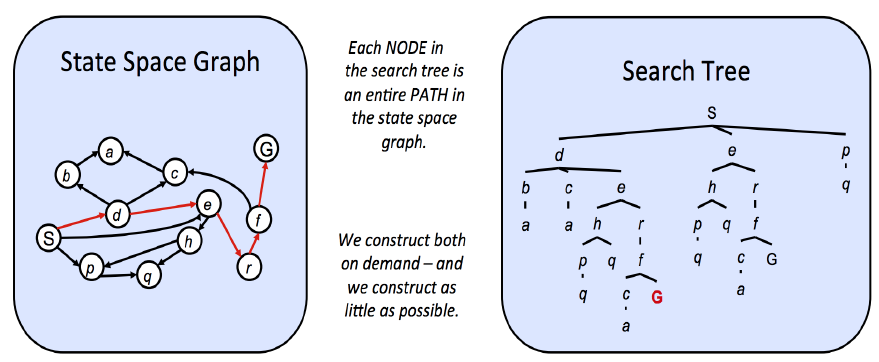
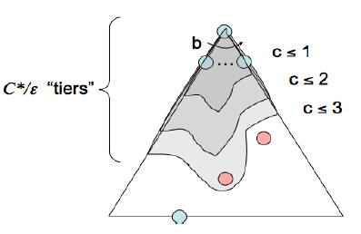

# Uninformed Search

## State Spaces and Search Problems

!!! question "search problem"
    Given our agent's current state, how can we arrive a new
    state that satisfies its goal in the best possible way?

A search problem consists of:

* A **state space**: The set of all possible states that
are possible in your given world.
* A set of **actions** available in each state.
* A **transition model**: Outputs the next state when
  a specific action is taken in a specific state.
* An action **cost**
* A **start state**
* A **goal test**: A function that takes a state as input,
  and determines whether it is a goal state.

### State Space Size

!!! note "fundamental counting principle"
    If there are $n$ variable objects in a given world
    which can take on $x_1$, $x_2$, ..., $x_n$ values
    respectively, then the total number of states is
    $x_1 \times x_2 \times \cdots \times x_n$.

### State Space Graph and Search Tree

* A **state space graph**
is constructed with states representing
nodes, with directed edges existing from a state to its children. These edges represent actions, and
any associated weights represent the cost of performing the corresponding action.
* **Search trees**: entire path(or **plan**) from the start state to the given state in the state space graph.

  {width="800"}

## Uninformed-Search

!!! note
    When we **have no knowledge of the location of goal
    states in our search tree**, we are forced to select our
    strategy for tree search from one of the techniques that falls under the umbrella of **uninformed search**.

Some rudimentary properties:

* **completeness**: if there exists a solution, is the strategy guaranteed to find it
  given infinite computational resources?
* **optimality**: is the strategy guaranteed to find the
  lowest-cost path to a goal state?
* **branching factor $b$**: The increase in the number of
  nodes on the frontier, each time a frontier node is expanded is $O(b)$.
  * At depth $k$ in the search tree, there are $O(b^k)$ nodes.
* The maximum depth $m$.
* The depth of the shallowest solution $s$.

### Depth-First Search

* *Description*: Always selects the *deepest* frontier node
  from the start node for expansion.
* *Frontier Representation*: To implement DFS, we require
  a structure that always gives the most recently added
  objects highest priority. A (LIFO) stack does this.
* *Completeness*: DFS is not complete.
* *Optimality*: DFS is not optimal.
* *Time Complexity*: $O(b^m)$
* *Space Complexity*: $O(bm)$

### Breadth-First Search

* *Description*: Always selects the *shallowest* frontier
  node from the start node for expansion.
* *Frontier Representation*: We desire a structure that
  outputs the oldest enqueued object to represent our frontier - a FIFO queue.
* *Completeness*: BFS is complete.
* *Optimality*: BFS is generally not optimal.
* *Time Complexity*: $O(b^s)$
* *Space Complexity*: $O(b^s)$

### Uniform-Cost Search

{width="350"}

* *Description*: Always selects the *lowest-cost* frontier
  node from the start node for expansion.
* *Frontier Representation*: A heap-based priority queue.
* *Completeness*: UCS is complete.
* *Optimality*: UCS is optimal if all costs are non-negative.
* *Time Complexity*: $O(b^{C^*/\epsilon})$
    * $C^*$ is the cost of the optimal solution.
    * $\epsilon$ is the minimum cost of any action.
* *Space Complexity*: $O(b^{C^*/\epsilon})$
