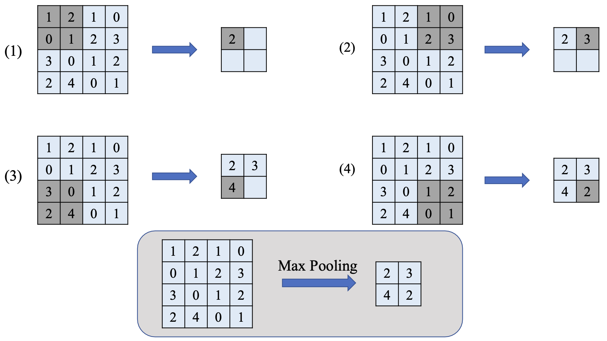

# Convolutional Neural Networks

## Convolution Operation

### Padding

As padding size increases, convolution gets more information, especially at the edges.

The attributes of padding:

1. Enable the acquisition of more information.
2. Increase the resolution of the output.

### Stride

Stride refers to the number of steps the filter moves each time.

The attributes of stride:

1. Allow the compression of partial information.
2. Reduce the resolution of the output.

### Pooling

Pooling is a widely used technique that mainly focuses on reducing the resolution of the output.

### The Calculation of Output Size

Define:
* image size: $(H, W)$
* filter size: $(FH, FW)$
* padding: $P$
* stride: $S$

Then the output size: $(OH, OW)$

$$
\begin{align*}
    OH = \frac{H + 2P - FH}{S} + 1 \\
    OW = \frac{W + 2P - FW}{S} + 1
\end{align*}
$$