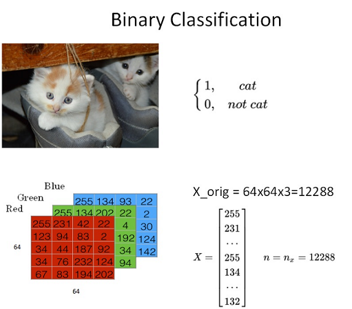
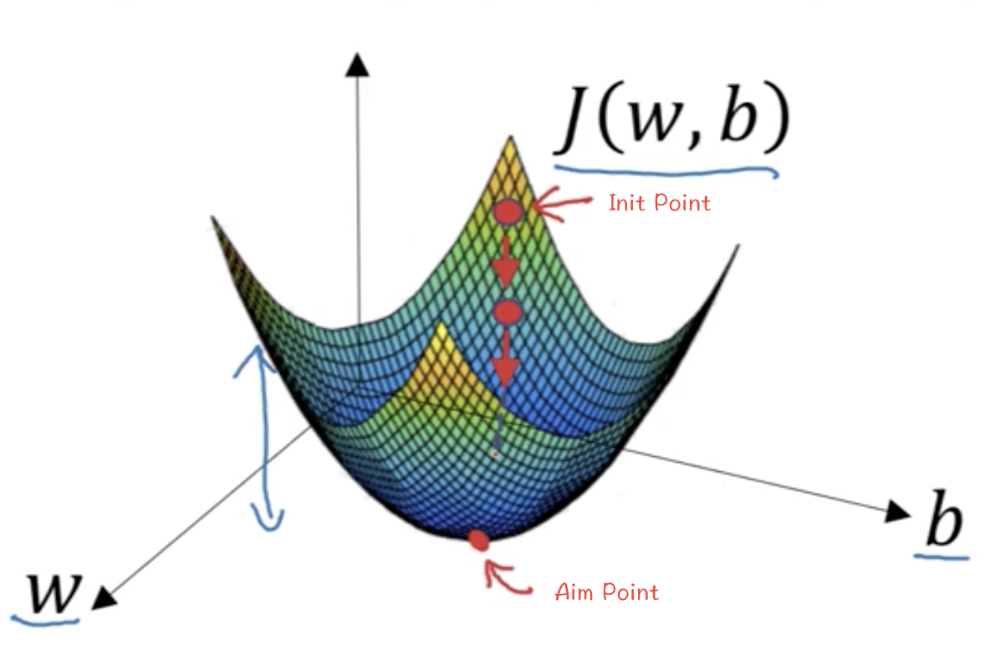
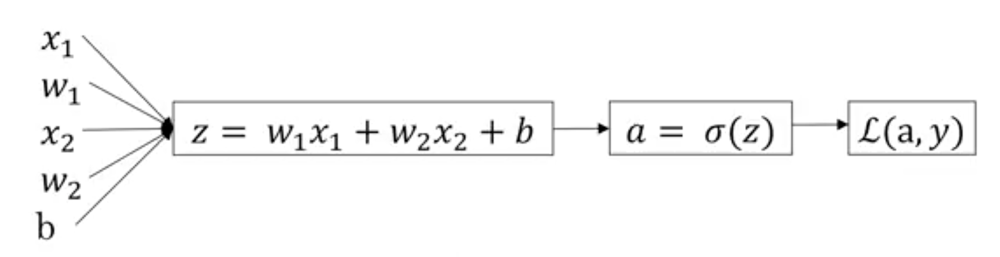

# Logistic Regression as a Neural Network

## Binary Classification

在二分类问题中，我们的目标是预测出一个二值的输出，即 $y$ 的值为 0 或 1。例如，我们要预测一张图片中是否包含猫，那么 $y$ 的值就是 0 或 1。



在神经网络模型中，首先要将图片输入x（维度是$(64, 64, 3)$）转化为一维的**特征向量（feature vector）**。方法是每个通道一行一行取，再连接起来。则转化后的输入特征向量维度为$(12288, 1)$。此特征向量$x$是列向量，维度一般记为$n_x$

如果训练样本共有$m$张图片，那么整个训练样本$X$组成了矩阵，维度为$(n_x,m)$。$Y$是一个行向量，维度为$(1,m)$。

## Logistic Regression

逻辑回归模型一般用来解决二分类（Binary Classification）问题。

$$
\text{Given} \ x, \quad \text{predict} \quad \hat{y} = P(y=1|x) \quad \text{where} \quad 0 \leq \hat{y} \leq 1
$$

* The input features vector: $x \in \mathbb{R}^{n_x}$, where $n_x$ is the number of features.

* The training label: $y \in \{0, 1\}$.
* The weights: $w \in \mathbb{R}^{n_x}$, where $n_x$ is the number of features.
* The bias: $b \in \mathbb{R}$.

The output of the logistic regression is:
$$
\hat{y} = \sigma(w^T x + b)
$$
where $\sigma$ is the sigmoid function:

$$
\sigma(z) = \frac{1}{1 + e^{-z}}
$$


> Sigmoid function将 $\hat{y}$ 的值限制在0到1之间。

## Logistic Regression Cost Function

Lost Function (aka. Error Function) 用来衡量模型的好坏。损失函数需要是凸函数，用于后续优化，因此像$L(\hat{y}, y) =  \frac{1}{2}(\hat{y} - y)^2$这样的函数就不适合。这里给出逻辑回归的损失函数：

$$
L(\hat{y}, y) = -(y \log \hat{y} + (1-y) \log (1-\hat{y}))
$$

Cost Function 是所有训练样本的平均损失函数，即对给定的$w$和$b$，$\hat{y}^{(1)}, \hat{y}^{(2)}, \cdots, \hat{y}^{(m)}$与
$y^{(1)}, y^{(2)}, \cdots, y^{(m)}$误差的平均值：

$$
J(w, b) = \frac{1}{m} \sum_{i=1}^m L(\hat{y}^{(i)}, y^{(i)})
$$

Loss Function针对单个样本，Cost Function针对整个训练集。

## Gradient Descent



Gradient Descent的目标是找到使得Cost Function最小的$w$和$b$。为了找到最小值，我们可以对$w$和$b$初始化任意值，然后不断迭代，每次迭代都朝着梯度的反方向移动一小步，直到达到最小值。

$$
\begin{align*}
w := w - \alpha \frac{\partial J(w, b)}{\partial w}\\
b := b - \alpha \frac{\partial J(w, b)}{\partial b}
\end{align*}
$$

其中$\alpha$是学习率（learning rate），用来控制每次迭代的步长。

## Logistic Regression Gradient Descent

假设输入数据x的维度n=2，则计算流程如下:


这里的 $a$ 是 $\hat{y}$ 。

整个从参数$w$, $b$推导到损失函数值的过程被称为**正向传播（forward propagation）**。而从损失函数值反向推导到参数$w$, $b$的过程被称为**反向传播（backward propagation）**。

## Gradient Descent on m Examples

迭代算法be like：

```python
J = 0, dw_1 = 0, dw_2 = 0, ..., dw_n = 0, db = 0
# iterate over all training examples
for i in range(m):
    # forward propagation
    z_i = w^T x_i + b
    a_i = sigmoid(z_i)
    J += -[y_i log(a_i) + (1-y_i) log(1-a_i)]
    # backward propagation
    dz_i = a_i - y_i
    for j in range(n):
        dw_j += x_j dz_i
    db += dz_i
# update parameters
J /= m
dw_1 /= m, dw_2 /= m, ..., dw_n /= m, db /= m
```

现在可以结合学习率$\alpha$来更新参数了：

```python
for j in range(n):
    w_j = w_j - alpha dw_j

b = b - alpha db
```

由于训练数据往往是非常大的，因此for loop很慢。我们可以通过向量化（vectorization）来加速计算。