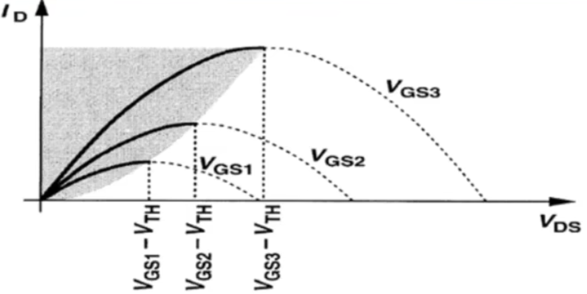

# MOS器件物理

## General considerations

### MOS symbols

### MOS as a switch

Need to know the threshold voltage $V_{th}$.

### MOS as a VCCS

MOS is also a voltage-controlled current source (VCCS).

Need to derive the I/V characteristics.

## MOS I/V characteristics

### Threshold voltage

When $V_{G} = 0$, the MOS is off.

When $V_{G}$ increases to a sufficiently positive value, the surface is "inverted" and the MOS is on.

The value of $V_{G}$ at this point is called the threshold voltage $V_{th}$.
If $V_{G}$ rises further, the charge density in channel continues to increase ($I_D$ increases).

$$
V_{TH} = \Phi_{MS} + 2\Phi_{F} + \frac{Q_{dep}}{C_{ox}} \\ 
$$

$$
C_{ox} = \frac{\epsilon_{ox}}{t_{ox}}
$$

* $\Phi_{MS}$: work function difference between the gate and substrate
* $\Phi_{F}$: Fermi level
* $Q_{dep}$: Charge density in the depletion region
* $C_{ox}$: Gate oxide capacitance per unit area

#### Important note about $V_{th}$

!!! info "For NMOS"

    the higher the substrate doping, the higher the $V_{th}$.

!!! warning ""

    For a given process under given temperature, $V_{th}$ is almost constant.

### I/V characteristics in triode region

$$
I_D = \mu_n C_{ox} \frac{W}{L} \left[ (V_{GS} - V_{TH})V_{DS} - \frac{V_{DS}^2}{2} \right], \quad V_{DS} \le V_{GS} - V_{TH}
$$

Observations: $I_D \propto W$

!!! info "In triode region"

    $I_D$ is influenced by both $V_{GS}$ and $V_{DS}$.

    $W/L$ is called "aspect ratio", a design parameter.

    $\mu_n C_{ox}$ is a process parameter.

### Application of NMOS in Triode region

$$
I_D \approx \mu_n C_{ox} \frac{W}{L} (V_{GS} - V_{TH})V_{DS}, \quad if \ \ \frac{V_{DS}}{2} \ll V_{GS} - V_{TH}
$$

$$
R_{on} = \frac{V_{DS}}{I_D} = \frac{1}{\mu_n C_{ox} \frac{W}{L} (V_{GS} - V_{TH})}
$$

深线性区（$V_{DS}$非常小），MOS管可以当成压控电阻，注意MOS管是压控器件

### I/V characteristics in saturation region

$$
I_D = \frac{1}{2} \mu_n C_{ox} \frac{W}{L} (V_{GS} - V_{TH})^2 = \frac{1}{2} \mu_n C_{ox} \frac{W}{L} (V_{OD})^2, \quad V_{DS} \ge V_{GS} - V_{TH} 
$$

$V_{OD} = V_{GS} - V_{TH}$ is called "overdrive voltage".

$$
V_{OD} = \sqrt{\frac{2I_D}{\mu_n C_{ox} \frac{W}{L}}}
$$

### Application of MOS in saturation region

当$V_{DS}$较大时，$I_D$不会随$V_{DS}$变化（非常缓慢），因此：

Saturated MOS can be used as voltage-controlled current source (VCCS).

### NMOS I/V characteristics summary

