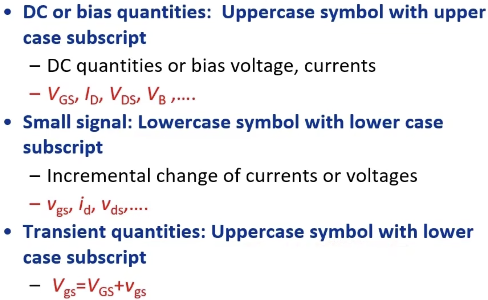
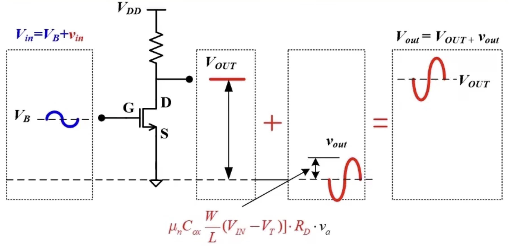
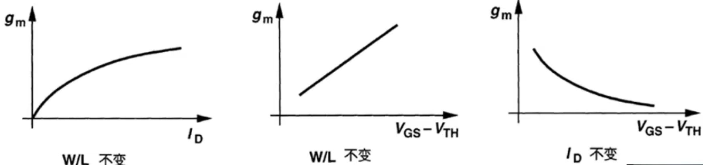
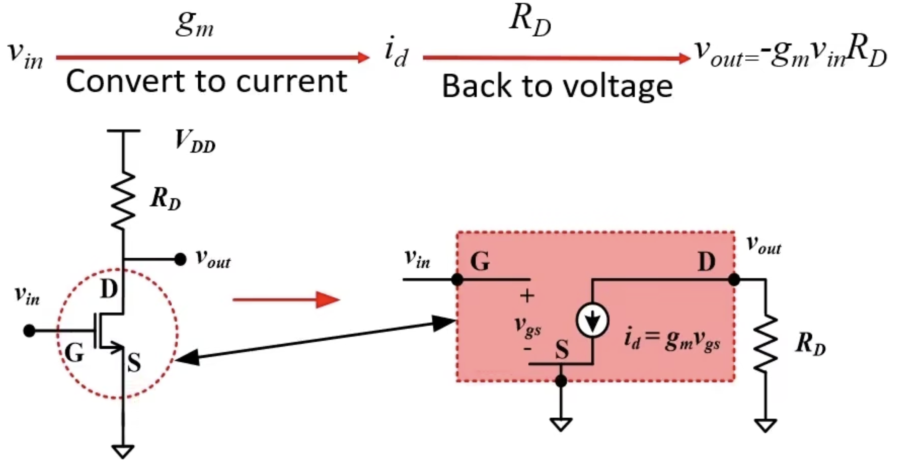

# MOS小信号模型

## Notations

## Understanding the concept of small signal model

### Transient response

$$
v_{in} = v_a \sin \omega t
$$

$$
v_{out} = -i_dR_d = -\mu_n C_{ox} \frac{W}{L} (V_{GS} - V_{TH})v_a \sin \omega t
$$

## Transconductance of MOS

$$
g_m = \mu_n C_{ox} \frac{W}{L} (V_{GS} - V_{TH}) = \sqrt{2 \mu_n C_{ox} \frac{W}{L} I_D} = \frac{2I_D}{V_{GS}- V_{TH}}
$$

### Three elements for calculating $g_m$

* There are only two independent elements in $W/L$, $I_D$ and $V_{GS} - V_{TH}$.
* Any one can be derived from the other two.

## Ideal small signal model of MOS

## Second order effect

### Body effect

### Channel length modulation effect