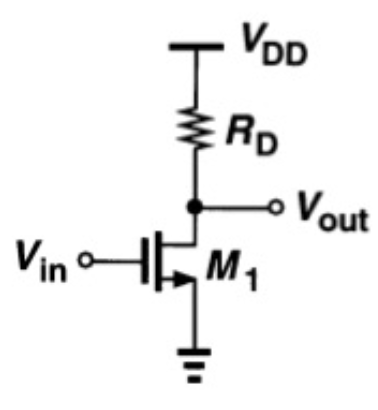

# Single Stage Amplifiers

## Ideal amplifier

* Linear
* Infinite input resistance
* Infinite driving capability

$$
v_{out}= A_v v_{in}
$$

## Common source amplifier

A single-transistor amplifier with the source connected to AC ground.

### CS-stage with resistive load

{align=left}
  
* $V_{in} < V_{TH}$: cut off, $V_{out} = V_{DD}$

* $V_{in} - V_{TH} < V_{out}$, saturation, $V_{out} = V_{DD} - I_dR_D$

* $V_{in} - V_{TH} > V_{out}$, linear

$$
A_v=\frac{\partial V_{o u t}}{\partial V_{i n}}=-\mu_n C_{o x} \frac{W}{L}\left(V_{i n}-V_{T H}\right) \cdot R_D
$$

$$
A_v = -g_m R_D
$$