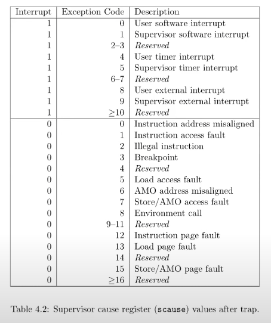

# Lab: xv6 lazy page allocation

## Background

- `sbrk()` allocates physical memory and maps it into the process's virtual address space
  - It can take a long time for a kernel to allocate and map memory for a large request.
- some programs allocate more memory than they actually use

!!! success "Solution"

    Allocate user memory lazily

`sbrk()` doesn't allocate physical memory, but **just remembers which user addresses are allocated and marks those addresses as invalid in the user page table**. When the process first tries to use any given page of lazily-allocated memory, the CPU **generates a** **page fault, which the kernel handles by allocating physical memory, zeroing it, and mapping it.**

## Eliminate allocation from sbrk()

!!! note "Task"

    * delete page allocation from the sbrk(n) system call implementation
    * new `sbrk(n)` should just increment the process's size `(myproc()->sz)` by `n` and return the old size
    * should not allocate memory

```c title="sysproc.c"
uint64
sys_sbrk(void)
{
  int addr;
  int n;
  struct proc* p = myproc();

  if(argint(0, &n) < 0)
    return -1;
  addr = p->sz;
  if (n >= 0) {
    p->sz += n;
  } else {
    p->sz = uvmdealloc(p->pagetable, p->sz, p->sz + n);
  }

  return addr;
}
```

当`n < 0`时，需要调用`uvmdealloc`释放不再需要的内存页，让进程的虚拟内存空间变小。

修改后，尝试在 xv6 中运行`echo hi`，会报错：

```bash title="xv6"
init: starting sh
$ echo hi
usertrap(): unexpected scause 0x000000000000000f pid=3
            sepc=0x0000000000001258 stval=0x0000000000004008
panic: uvmunmap: not mapped
```



- `scause=0x000000000000000f`表示 Page fault

`sbrk`没有 allocate memory，运行`echo hi`的时候访问了 invalid 的 virtual address，因此发生了 page fault。

## Lazy allocation

!!! note "Task"

    * respond to a page fault from user space
        * mapping a newly-allocated page of physical memory at the faulting address
        * returning back to user space to let the process continue executing
    * Modify whatever other xv6 kernel code you need to in order to get `echo hi` to work.

**check whether a fault is a page fault by seeing if `r_scause()` is 13 or 15 in `usertrap()`**

```c title="trap.c, usertrap"
  if(scause == 8){
    // ...
  } else if((which_dev = devintr()) != 0){
    // ok
  } else if ((scause == 13 || scause == 15) && uvmshouldtouch(p, r_stval())) {
    // page fault
    uvmlazytouch(p, r_stval());
  } else {
    // ...
  }
```

我这里用函数封装逻辑，更简洁。

```c title="vm.c, uvmshouldtouch"
int
uvmshouldtouch(struct proc *p, uint64 va)
{
  // Kill a process if it page-faults on a virtual memory address
  // higher than any allocated with sbrk().
  if (va >= p->sz)
    return 0;

  // Handle faults on the invalid page below the user stack.
  // should not touch guard page below stack
  if (PGROUNDDOWN(va) <= p->trapframe->sp)
    return 0;

  pte_t *pte = walk(p->pagetable, va, 0);
  return pte == 0 || (*pte & PTE_V) == 0;
}
```

根据 lazy，只有当`va`对应的页表项不存在或者对应的物理页不存在时，才需要分配物理页。

- Handle out-of-memory correctly: if `kalloc()` fails in the page fault handler, kill the current process.

```c title="vm.c, uvmlazytouch"
void
uvmlazytouch(struct proc *p, uint64 va)
{
  va = PGROUNDDOWN(va);
  char *mem = kalloc();
  if (mem == 0) {
    printf("lazy: out of memory\n");
    p->killed = 1;
  } else {
    memset(mem, 0, PGSIZE);
    // 创建PTE，将物理页映射到虚拟地址
    if (mappages(p->pagetable, va, PGSIZE, (uint64)mem, PTE_W | PTE_X | PTE_R | PTE_U) != 0) {
      printf("lazy: failed to map page\n");
      kfree(mem);
      p->killed = 1;
    }
  }
}
```

此时`echo hi`可以正常运行，但是已经破坏了 kernel，需要修复。

**Handle the parent-to-child memory copy in fork() correctly.**

```c title="vm.c, uvmcopy"
int
uvmcopy(pagetable_t old, pagetable_t new, uint64 sz)
{
  // ...
  for(i = 0; i < sz; i += PGSIZE){
    if((pte = walk(old, i, 0)) == 0)
      continue;
    if((*pte & PTE_V) == 0)
      continue;
    // ...
  }
  // ...
}
```

在 lazy 策略下，page table 中肯定存在 PTE 不存在或 invalid 的情况，如果检测到了 continue 即可（之前是直接 panic）

**Handle the case in which a process passes a valid address from sbrk() to a system call such as read or write, but the memory for that address has not yet been allocated.**
阅读代码后发现，`read`与`write`使用两个函数来处理用户和内核之间的数据传输：

- `copyout`: Copy from kernel to user.
- `copyin`: Copy from user to kernel.

于是只需要在这两个函数中处理 lazy page allocation 即可。

```c title="vm.c, copyout"
int
copyout(pagetable_t pagetable, uint64 dstva, char *src, uint64 len)
{
  uint64 n, va0, pa0;
  struct proc *p = myproc();

  while(len > 0){
    va0 = PGROUNDDOWN(dstva);
    // MY CODE BEGIN
    if (uvmshouldtouch(p, va0)) {
      uvmlazytouch(p, va0);
    }
    // END
    pa0 = walkaddr(pagetable, va0);
    if(pa0 == 0)
      return -1;
    n = PGSIZE - (dstva - va0);
    if(n > len)
      n = len;
    memmove((void *)(pa0 + (dstva - va0)), src, n);

    len -= n;
    src += n;
    dstva = va0 + PGSIZE;
  }
  return 0;
}
```

```c title="vm.c, copyin"
int
copyin(pagetable_t pagetable, char *dst, uint64 srcva, uint64 len)
{
  uint64 n, va0, pa0;
  struct proc *p = myproc();

  while(len > 0){
    va0 = PGROUNDDOWN(srcva);
    // MY CODE BEGIN
      if (uvmshouldtouch(p, va0)) {
      uvmlazytouch(p, va0);
    }
    // END
    pa0 = walkaddr(pagetable, va0);
    if(pa0 == 0)
      return -1;
    n = PGSIZE - (srcva - va0);
    if(n > len)
      n = len;
    memmove(dst, (void *)(pa0 + (srcva - va0)), n);

    len -= n;
    dst += n;
    srcva = va0 + PGSIZE;
  }
  return 0;
}
```

逻辑都差不多：检查 user 传入的 virtual address，判断是否需要分配物理页。

---

最后运行 lazytests & usertests，happy ending！
