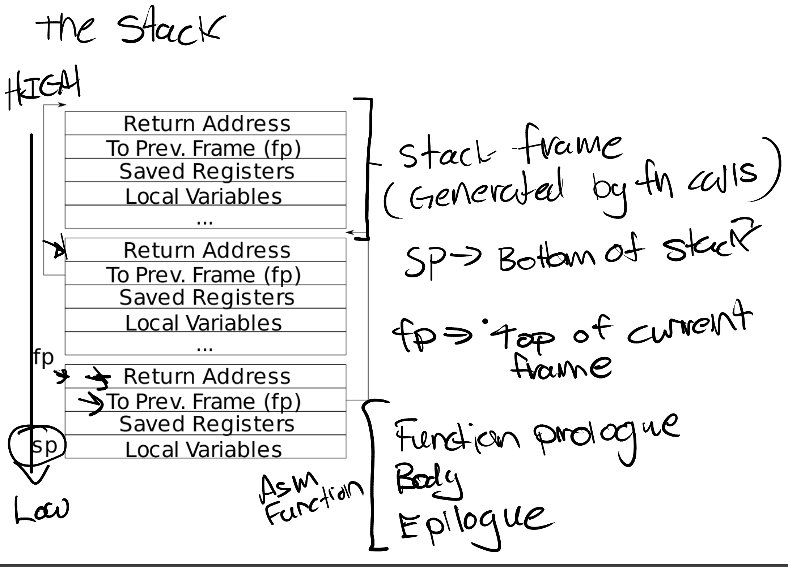

# Lab: Trap

## Backtrace

<aside> 📌 Backtrace: a list of the function calls on the stack above the point at which the error occurred.

</aside>

目的：当 kernel panic 的时候能够打印出 backtrace 信息

对于这个实验，很重要的一张图：



stack 从高地址向低地址增长，在这个图是从上到下的方向。而 backtrace 是从最 low 的 stack 开始（也就是最新的、刚刚发生 panic 的 stack），从下往上遍历所有 stack。

大概思路有了之后，跟着 hints 把实验做完

**Add the prototype for backtrace to kernel/defs.h so that you can invoke backtrace.**

```c
// defs.h
void            backtrace(void);
```

这里告诉我们怎么提取`ra`(return address)和上一个栈的`fp`

**Xv6 allocates one page for each stack in the xv6 kernel at PAGE-aligned address. You can compute the top and bottom address of the stack page by using PGROUNDDOWN(fp) and PGROUNDUP(fp). These number are helpful for backtrace to terminate its loop.**

这里告诉我们应该在什么时候停止遍历。

---

```c
void
backtrace(void)
{
	// 获取当前的fp
  uint64 fp = r_fp();
	// 因为栈是从高地址向低地址增长的，所以应该使用PGROUNDUP获得stack底部
  uint64 stack_page_bottom = PGROUNDUP(fp);
  while (fp != stack_page_bottom) {
		// return address
    printf("%p\n", *(uint64 *)(fp - 8));
		// previous frame pointer
    fp = *(uint64 *)(fp - 16);
  }
}
```

## Alarm

<aside>
📌 periodically alerts a process as it uses CPU time

</aside>

- add a new `sigalarm(interval, handler)` system call
- If an application calls `sigalarm(n, fn)`, then after every `n` "ticks" of CPU time that the program consumes, the kernel should cause application function `fn` to be called.
- When `fn` returns, the application should resume where it left off.

### **test0: invoke handler**

这个部分先完成`sigalarm`，让 kernel 能够跳转到 alarm handler，而不考虑恢复

**Update `user/usys.pl` (which generates `user/usys.S`), `kernel/syscall.h`, and `kernel/syscall.c` to allow `alarmtest` to invoke the `sigalarm` and `sigreturn` system calls**

- **`user/usys.pl`：**Generate usys.S, the stubs for syscalls. 有了 stub，用户程序的系统调用请求就可以被转发到内核，以便执行相应的系统调用

**Your `sys_sigalarm()` should store the alarm interval and the pointer to the handler function in new fields in the `proc` structure.**

**You'll need to keep track of how many ticks have passed since the last call to a process's alarm handler; you'll need a new field in struct `proc` for this too. You can initialize `proc` fields in `allocproc()` in `proc.c`.**

**When a trap on the RISC-V returns to user space, what determines the instruction address at which user-space code resumes execution?**

这是一个非常重要的提示：当 RISC-V 从 kernel 返回 user space 的时候

> …returning to user space…setting `sepc` to the previously saved user program counter

`usertrap`中的代码：

```c
// save user program counter.
p->trapframe->epc = r_sepc();
```

`usertrapret`中的代码：

```c
// set S Exception Program Counter to the saved user pc.
w_sepc(p->trapframe->epc);
```

所以只要修改`p->trapframe->epc`，就可以控制 user space 代码 resumes execution 的位置
