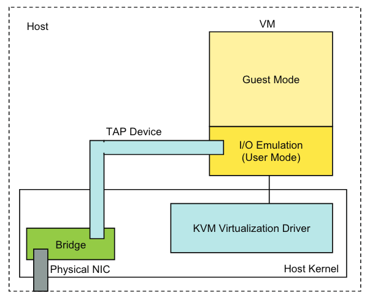

# Evaluating Standard-Based Self-Virtualizing Devices: A Performance Study of 10GbE NICs with SR-IOV Support

## Summary

The hardware-based SR-IOV approach provides superior performance
to the software-based approach in KVM.

SR-IOV approach has great potential to achieve high performance I/O
in a virtualized environment.

## Outline

### Introduction

We can divide the current I/O virtualization models into two categories:

* Software-based  
    * Several software components (e.g., hypervisor, guest VMs...) work together
    to provide access points to VMs without special hardware support.
    * Major concern: may suffer significant performance degradation - overheads
    such as context/control switches and memory copies.
* Hardware-based
    * Potentially achieve higher performance by allowing direct hardware access
    from within a guest VM.

### Background

#### SR-IOV

#### I/O Virtualization in KVM

Network Virtualization in KVM:

{width=60%}

When code within a virtual machine attempts to send network packets through a virtual network interface card, the virtual machine needs to perform a **VM exit**. This **transfers control to the I/O emulation code in the user space of the host machine to handle these packets**. The process includes:

1. The program within the virtual machine tries to perform a network operation, such as sending a packet.
2. As the virtual machine cannot directly communicate with physical hardware, this operation triggers a VM exit, causing the execution of the virtual machine to be suspended.
3. Control is passed to the host's KVM module, which identifies the operation as a network action.
4. KVM transfers control to the I/O emulation code running in user mode.
5. The I/O emulation code sends or receives network packets through the user space TAP device.
6. Once the network I/O operation is complete, control is returned to the virtual machine, which then continues to execute the remaining instructions.

### Evaluation Methodology

#### Experimental Testbed

* Two servers with a back-to-back 10 GbE connection.
  * Primary server
  * Secondary server
* NIC with support for SR-IOV

#### Test Cases, Benchmarks and Data Collection

* SR-IOV: This is the case where PCI passthrough is used to dedicated a virtual function of the X3100 10 GbE NIC to each VM.
* VIRTIO: The software approach is used in this case where a TAP interface is used to emulate a NIC in each VM and bridged to the X3100 NIC in the host. The emulated NICs in the guest VMs are based on virtio.
* Native: The tests are done in native Linux without using any VMs.

### Evaluation

Latency, Bandwidth, Inter-VM Communication etc.

## Limitation or Extension

## My Opinion