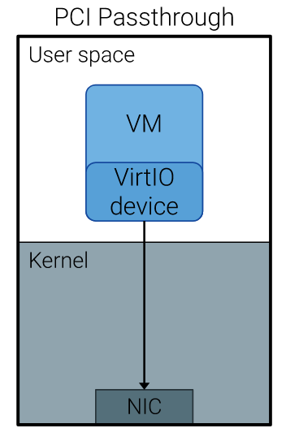
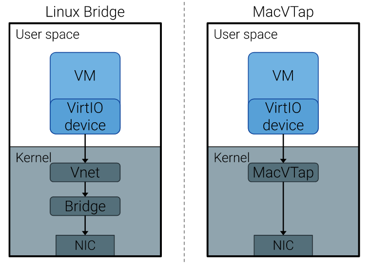

# Measuring the impact of SR-IOV and virtualization on packet round-trip time

## Summary

This paper presents a comprehensive study on the impact of Single Root I/O Virtualization (SR-IOV) and various virtualization technologies on packet **round-trip time (RTT)** in cloud computing environments. The authors, through a series of controlled experiments, aim to understand **the performance implications of SR-IOV when paired with different configurations and loads in a Kernel-based Virtual Machine (KVM) setting**.

## Main Points

### Introduction

* **Resource virtualization** has proven beneficial across data centers,
  telecommunications systems, and computer networks.
* Several **performance issues** need consideration when using virtualization.
* Several networking solutions have emerged
    * **Virtual Machine Device Queues (VMDQ)**: offloads packet sorting from the virtual machine manager (VMM), the hypervisor, to the network controller to accelerate network I/O throughput.
    * **PCI Passthrough and SR-IOV**: Both aimed at lowering packet processing latency by acting at the hardware level.

!!! tip ""
    Choosing the appropriate technology for a given use case is still
    an open research issue.

### Virtualization and single root I/O virtualization

Single Root I/O Virtualization (SR-IOV) is a hardware-based networking technology that allows a **single physical input/output (I/O) device to present itself as multiple virtual devices with similar capabilities.**

As SR-IOV is "simply" a physical technology, there are multiple ways to logically connect it to user space processes. However, regarding interfacing virtual machines and SR-IOV, two main designs dominate the scene.

#### PCI passthrough

{width=30%}

!!! note "PCI Passthrough"
    PCI Passthrough is a mechanism that **assigns host PCI devices directly to the virtual machines (VMs) and acts as a hypervisor bypass**.

    * allows a VM to directly connect to the PCI device, behaving as if it was physically connected
    * the hypervisor no longer has to perform packet translation between the VM and the host.

Removing the hypervisor from the data plane is a clear step to mitigate
performance degradation caused by context switches and memory copies between VMs and the hypervisor during packet processing.

**SR-IOV is typically utilized in combination with PCI Passthrough.**

#### Standard virtual drivers

{width=65%}

## Limitations or Extensions

