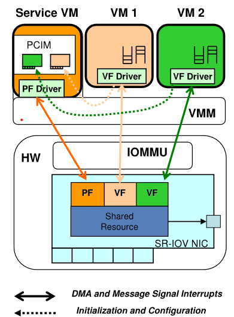

# High performance network virtualization with SR-IOV

> Background: 
> https://learn.microsoft.com/en-us/windows-hardware/drivers/network/overview-of-single-root-i-o-virtualization--sr-iov-
>
> * SR-IOV allows a device, such as a network adapter, **to separate access to its resources** among various PCIe hardware functions. These functions consist of the following types:
>     * A PCIe Physical Function (PF)
>     * One or more PCIe Virtual Functions (VFs): A VF shares one or more physical resources of the device, such as a memory and a network port, with the PF and other VFs on the device.

## Summary

A generic **virtualization architecture that can be implemented on various Virtual Machine Monitors (VMMs)**, including optimizations to reduce virtualization overhead and a dynamic network interface switching scheme to facilitate virtual machine migration without sacrificing performance.

## Outline

### SR-IOV virtualization architecture

{width="400"}

## My opinion

### SR-IOV vs VirtIO

* **Hardware Requirements**
    * **SR-IOV:** Requires specific hardware support for virtual functions (VFs) on network cards.
    * **VirtIO:** Hardware-agnostic, does not require specific hardware support and can work with standard network devices.
* **Data Path**
    * **SR-IOV:** Allows direct data path between VMs and physical hardware, bypassing the hypervisor for I/O transactions.
    * **VirtIO:** The data path goes through the hypervisor, which handles I/O operations between VMs and hardware.
* **Performance**
    * **SR-IOV:** Allows direct data path between VMs and physical hardware, bypassing the hypervisor for I/O transactions.
    * **VirtIO:** The data path goes through the hypervisor, which handles I/O operations between VMs and hardware.
* **Portability and Compatibility**
    * **SR-IOV:** Less portable due to hardware dependencies
    * **VirtIO:** High portability and compatibility across different hypervisors and hardware platforms.

